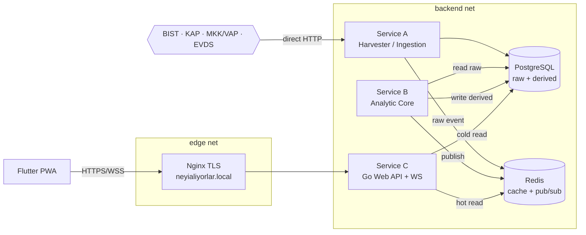
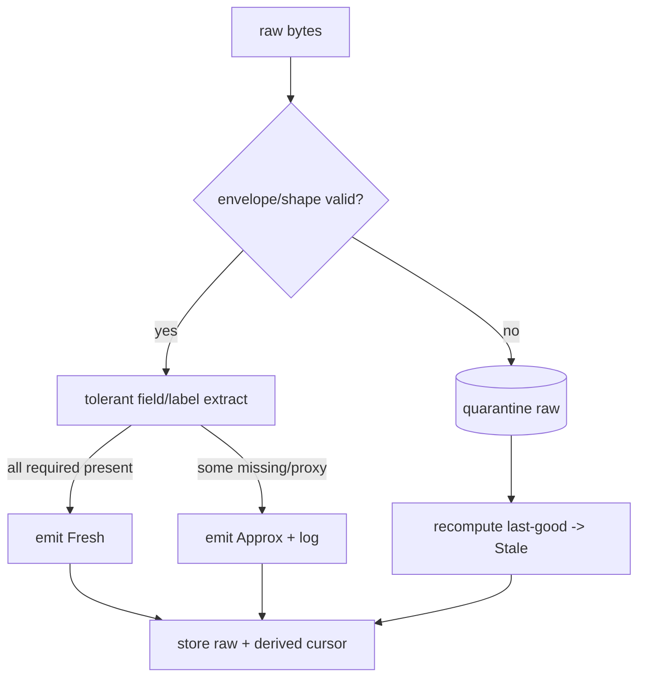
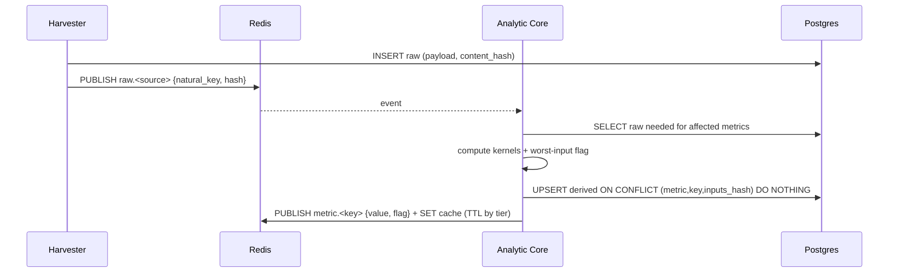
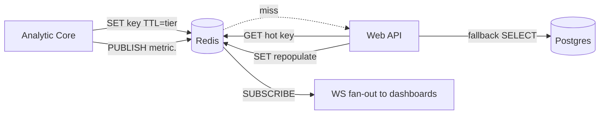
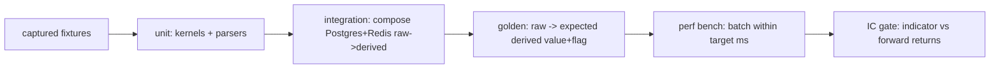

# 🗺 ROADMAP — `neyialiyorlar`

> **Single source of truth for sequenced work.** A local-only
> (`https://neyialiyorlar.local`) institutional-liquidity research system for
> the Turkish equity & fund market, sourced from **verified-live** public feeds
> (BIST · KAP · MKK/VAP · CBRT EVDS). Agents implement phase-by-phase, drain
> every `[ ]` bullet in scope, append tracking rows, then stage.
>
> **Companion docs (read first):** [CHARTER](../project/CHARTER.md) ·
> [DATA_SOURCES](../design/DATA_SOURCES.md) ·
> [METRICS_CATALOG](../design/METRICS_CATALOG.md) ·
> ADR [0001](../design/ADR-0001-go-primary-backend.md)
> [0002](../design/ADR-0002-raw-then-derived-ingestion.md)
> [0003](../design/ADR-0003-staleness-confidence-flags.md)
> [0004](../design/ADR-0004-scraping-within-tos.md) ·
> [GLOSSARY](../project/GLOSSARY.md).

> **Experimental & development use only.** This is a local, single-analyst
> research tool — **not** a production or public service. It targets public,
> unauthenticated endpoints directly and **does not consult or honour
> `robots.txt`**, and it makes **no** Terms-of-Service compliance guarantee. It
> still **self-limits its own load** (per-host concurrency cap, exponential
> backoff, `Retry-After`) so it stays reliable and avoids bans, and it still does
> **no** WAF/CAPTCHA/TLS-fingerprint/proxy-rotation evasion (WAF-protected
> portals remain excluded — [ADR-0004](../design/ADR-0004-scraping-within-tos.md)).
> Operators are responsible for their own use of the data.

## 📊 Status snapshot

Update with `make roadmap.status` (parses the `[ ]` / `[x]` boxes below).

| Phase | Items | Done | Status |
|---|---|---|---|
/im| 1 — Micro-microstructure & Local Env Setup | 29 | 29 | ✅ complete |
| 2 — Data Ingestion & Self-Adaptive Scraper | 25 | 0 | ⚪ planned |
| 3 — Metric Computation (Go Analytic Core) | 20 | 20 | ✅ complete |
| 4 — Database Schema & Redis Caching Topology | 20 | 0 | ⚪ planned |
| 5 — Front-End Dashboard (Flutter PWA) & API | 23 | 0 | ⚪ planned |
| 6 — TDD, IC Validation & Alignment | 22 | 0 | ⚪ planned |

## 🧭 Guiding principles

- **Honesty over coverage.** No proxy is rendered as a measurement; no value is
  ever fabricated. Every metric carries `fresh | stale | approx`.
- **Right-sized, not HFT-extreme.** Static Go binaries, low memory, batch
  scheduling, Redis hot reads, targeted Postgres indexes — *no* zero-copy /
  lock-free / SIMD / GPU. ([ADR-0001](../design/ADR-0001-go-primary-backend.md))
- **Raw-then-derived.** Persist untouched payloads first; recompute metrics
  idempotently. ([ADR-0002](../design/ADR-0002-raw-then-derived-ingestion.md))
- **Experimental scraping (dev only).** Self-adaptive extraction that **does not
  consult `robots.txt`** and makes no ToS-compliance claim, but **self-limits
  load** (per-host concurrency cap, backoff, `Retry-After`) and still performs
  **no** WAF/CAPTCHA/proxy-rotation evasion.
  ([ADR-0004](../design/ADR-0004-scraping-within-tos.md))
- **Point-in-time, no look-ahead.** A value is joined/scored at the time it
  was *knowable*, never at the timestamp it later describes. Lagged refinements
  (MKK T+10, weekly EVDS) align on their **knowledge date**, so backtests and the
  IC gate cannot be inflated by data that did not exist yet. (Mandate 20)
- **Numerical honesty.** A kernel never emits `NaN`/`±Inf`; a degenerate input
  (zero variance, too few samples) yields a **gap**, not a fabricated or
  undefined number. (Mandate 21)
- **Locale & identity integrity.** Turkish numbers (`1.234,56` = dot-thousands /
  comma-decimal) and the full Turkish letter set (`ç ğ ı İ ö ş ü` + capitals) are
  parsed/folded locale-correctly, and every
  value is keyed to a **stable entity id** (ISIN / MKK code), never a churning
  display ticker — a mis-scaled number or a mismatched ticker is a silent, fatal
  data error. (Mandates 22, 23)
- **Honest returns.** The IC benchmark uses **corporate-action–adjusted,
  survivorship-complete** prices — a capital-increase day is never a fake −50 %,
  and delisted names are never silently dropped from the sample. (Mandate 25)
- **Untrusted by default.** Every external payload (JSON/HTML/PDF) is parsed
  under size, time, and decompression-ratio caps — a hostile or malformed source
  degrades to a quarantine, never an OOM or a hang. (Mandate 17)
- **Concurrency & supply-chain safety.** Every service is `-race`-clean and
  built from digest-pinned base images under an **offline** `make ci` that runs
  lint + `go test -race` + `govulncheck`. (Mandates 24, 26)
- **TDD first.** Specs + golden fixtures before implementation.
- **Tests move with code** in the same commit. Smallest change that goes green.
- One owner per phase; one tracking `run_id` per implementation pass.

## 🏛 System overview

Three Go runtime services + Postgres + Redis behind Nginx, one
`docker-compose.yml`, one mounted config blueprint, per-service `.env`.



**Data flow:** sources → Harvester (raw-then-derived, store first) → Analytic
Core (idempotent recompute per cadence, attach confidence flag) → Postgres
(derived) + Redis (hot cache, cadence-aligned TTL, pub/sub) → API (REST/WS) →
Flutter terminal. **Confidence flag travels end-to-end.**

> **Durability note (binding).** Redis **pub/sub is ephemeral fan-out only** — a
> message not delivered to a connected subscriber is lost, and AOF does **not**
> replay it. The **durable source of truth is Postgres**; the hot cache is
> write-through and always reconstructable from the `mv_hot` covering index. The
> Analytic Core's scheduled-fallback recompute (Phase 3) is what guarantees no
> derived row is permanently missed after a Redis restart — *not* AOF.
> ([ADR-0002](../design/ADR-0002-raw-then-derived-ingestion.md))

## 📐 Architectural mandates (binding on every phase)

| # | Mandate | Where enforced |
|---|---|---|
| 1 | Full containerization, one compose, Nginx proxy, labels/nets/volumes | P1 |
| 2 | Per-service `.env`; compose stays credential-free | P1 |
| 3 | Single centralized config blueprint mounted everywhere | P1, all |
| 4 | Clean architecture; tiny files; structured perf-rationale comments | P2–P5 |
| 5 | TDD: unit + integration + perf specs **before** logic | P6, all |
| 6 | Absolute reliability: backoff, breakers, self-healing schema, recovery | P2, P4 |
| 7 | Right-sized efficiency (no zero-copy/lock-free/SIMD/GPU) | all |
| 8 | Local TLS at `neyialiyorlar.local` (mkcert), host scripts L/mac/Win | P1 |
| 9 | Self-adaptive scraping for **experimental/dev use**: **no `robots.txt`**, no ToS guarantee; load self-limited (concurrency cap, backoff, `Retry-After`); still **no** WAF/CAPTCHA/proxy-rotation evasion | P2 |
| 10 | Dev/experimental only — no secret/hardening policy yet | all |
| 11 | Multi-stage Dockerfiles; runtime image ≤ 20 MB (distroless or alpine) | P1, all |
| 12 | Structured logging (`log/slog`) with canonical fields in every Go service | P1, all |
| 13 | Graceful SIGTERM + SIGINT shutdown; every long-running service drains cleanly | P1, all |
| 14 | Every DB migration has a matching rollback (`.down.sql`); `make db.rollback` is tested | P4 |
| 15 | **Every** long-running service (incl. nginx, harvester, analytic) exposes a healthcheck; liveness vs readiness are distinct (readiness gates `depends_on`) | P1, all |
| 16 | `restart: unless-stopped` + right-sized `mem_limit`/`cpus` on every service — unattended stability on one host (no OOM cascade) | P1, all |
| 17 | Untrusted-input hardening on every external payload: max-bytes cap, parse timeout, decompression-ratio (zip/PDF-bomb) guard, bounded redirect/HTTPS-only client | P2, P5 |
| 18 | One shared **BIST trading-session calendar** (sessions + holidays) drives every daily-close batch, cadence tick, and "trading-day" horizon — no naive weekday math | P2, P3, P6 |
| 19 | An **offline** `make ci` gate (build + unit + integration + lint) runs with **no live network** — every "in CI" claim in this roadmap resolves to this target | all |
| 20 | Point-in-time integrity: derived rows and the IC gate consume **as-known** values; lagged refinements align on knowledge date — no look-ahead | P3, P6 |
| 21 | Numerical integrity: kernels are total — no `NaN`/`±Inf`/panic; zero-variance or insufficient-sample inputs produce a flagged **gap** | P3, P6 |
| 22 | Locale-correct Turkish parsing: numeric `1.234,56` (dot-thousands / comma-decimal) and **Unicode-aware** case-folding over the whole Turkish alphabet (`ç ğ ı İ ö ş ü` + capitals) via `language.Turkish` — covering the dotted/dotless `I`↔`ı`, `i`↔`İ` rule default folding gets wrong **and** the `ç ğ ö ş ü` round-trip an ASCII fold would skip; never naive `strconv.ParseFloat` or ASCII case-fold | P2, P3 |
| 23 | Stable entity identity: securities/funds keyed by **ISIN / MKK code**, never the display ticker; one versioned entity + theme-basket + corporate-action reference is the identity backbone | P2, P3, P4, P6 |
| 24 | Concurrency safety: every service passes `go test -race`; the WS hub, circuit breaker, single-flight cache, scheduler, and `latest`-key write are race-clean and monotonic | all |
| 25 | Honest returns: the IC right-hand side uses **corporate-action–adjusted**, **survivorship-complete** prices (delisted names retained), aligned point-in-time (with mandate 20) | P2, P6 |
| 26 | Supply-chain & build integrity: pinned base-image **digests**, version-stamped binaries, and an offline `make ci` running lint + `go test -race` + `govulncheck` | P1, all |

## 📑 Table of contents

- [Phase 1 — Micro-microstructure & Local Env Setup](#phase-1--micro-microstructure--local-env-setup)
- [Phase 2 — Data Ingestion & Self-Adaptive Web Scraper Architecture](#phase-2--data-ingestion--self-adaptive-web-scraper-architecture)
- [Phase 3 — Metric Computation (Go Analytic Core)](#phase-3--metric-computation-go-analytic-core)
- [Phase 4 — Database Schema & Redis Caching Topology](#phase-4--database-schema--redis-caching-topology)
- [Phase 5 — Front-End Dashboard (Flutter PWA) & REST/WS API](#phase-5--front-end-dashboard-flutter-pwa--restws-api)
- [Phase 6 — TDD, IC Validation & Alignment](#phase-6--tdd-ic-validation--alignment)
- [Appendix A — Tracking conventions](#appendix-a--tracking-conventions)
- [Appendix B — Definition of done](#appendix-b--definition-of-done)
- [Appendix C — Future / out of scope](#appendix-c--future--out-of-scope)

---

## Phase 1 — Micro-microstructure & Local Env Setup

**Goal.** Bring the whole stack up locally behind `https://neyialiyorlar.local`
from a single `docker-compose.yml`, with a trusted local cert, per-service
`.env`, and one mounted centralized config — **zero host installs** beyond
Docker + mkcert.

**Scope id.** `phase-1`

**Test plan.** `docker compose config --quiet` exits 0 (no compose errors, no
undefined env). `make up` brings **all six core services** (`nginx`, `api`,
`harvester`, `analytic`, `postgres`, `redis`) to `(healthy)` in `docker compose
ps`; the `research` and `tools` profiles stay down. **Trusted-cert proof (no
`-k`):** `curl -I https://neyialiyorlar.local` returns `200` *without*
`--insecure` — relying on the mkcert root CA in the OS trust store — **and**
`curl --cacert "$(mkcert -CAROOT)/rootCA.pem" -I https://neyialiyorlar.local`
also returns `200`; the Phase-1 placeholder shell makes `/` answer `200` before
any Flutter build exists. Per-service healthcheck exits 0
(`docker compose exec <svc> /app/<svc> -healthcheck` for the three Go services;
`wget -qO- http://127.0.0.1/healthz` inside `nginx`). **Graceful shutdown:**
`docker compose stop --timeout 5` returns before the timeout for every service
(no `137`/SIGKILL exit code in `docker compose ps -a`). **Idempotency:**
`docker compose down -v && make up` reproduces the all-healthy state. **Image
budget:** `docker image inspect --format '{{.Size}}' <svc>` is ≤ 20 MB for each
Go service. **Config tests:** `(cd services && go test ./shared/config/...)`
passes — including the env-overlay-precedence case (env wins for secrets) and the
secret-absent-from-YAML case (no secret is ever read from `config.yaml`).
`make doctor` exits 0; `make ci` exits 0 **with no network access**.
**Container hygiene:** every service runs with `no-new-privileges`,
`cap_drop: [ALL]`, and a read-only root filesystem (writable only on its declared
volume/`tmpfs`); a write to the root FS inside a Go service is denied.
**Boot validation:** a config with a negative TTL or `max_concurrent_per_host: 0`
**aborts** startup with a named error (not a warning), and a `.env` missing a
required secret (e.g. `PGPASSWORD`) aborts with a named error rather than a
mid-run nil/auth failure. **Start-period:** a deliberately slow first boot still
reaches `(healthy)` without being force-killed (every healthcheck declares a
`start_period`). **Log rotation:** the `logging` block caps container logs at the
configured `max-size`/`max-file`. **Build integrity:** every image is
digest-pinned (`docker compose config` shows `@sha256:` for each) and each Go
binary echoes its git sha + build date in the startup log and `-healthcheck`
output. **Offline CI stack:** `make ci` runs `gofmt -l` (empty), `go vet`,
`golangci-lint`, `go test -race ./...`, and `govulncheck` (vendored advisory DB)
with no live network.

#### 1.1 Repo layout created this phase

```
neyialiyorlar/
├── docker-compose.yml            # the single orchestrator (no inline creds)
├── config/
│   └── neyialiyorlar.yaml         # ← single source of truth (mounted RO everywhere)
├── deploy/
│   ├── nginx/
│   │   ├── neyialiyorlar.local.conf
│   │   └── certs/                 # mkcert output (gitignored)
│   └── env/
│       ├── api.env.example        # per-service .env templates (real .env gitignored)
│       ├── harvester.env.example
│       ├── analytic.env.example
│       ├── postgres.env.example
│       ├── redis.env.example
│       └── research.env.example   # research sidecar (separate from analytic.env)
│   └── web/
│       └── index.html             # Phase-1 placeholder shell (Phase 5 replaces with the PWA build)
└── scripts/
    ├── setup-hosts.sh             # Linux/macOS hosts entry
    ├── setup-hosts.ps1            # Windows hosts entry
    └── make-certs.sh              # mkcert root CA + leaf cert
```

#### 1.2 Step-by-step: `neyialiyorlar.local` across Linux / macOS / Windows

**(a) Trusted local CA + leaf cert (mkcert style) — `scripts/make-certs.sh`:**

```bash
#!/usr/bin/env bash
# Generate a locally-trusted cert for neyialiyorlar.local.
# Rationale: a real trusted chain avoids browser warnings + lets the Flutter
# PWA register a service worker (SW requires a secure context).
set -euo pipefail
command -v mkcert >/dev/null || { echo "install mkcert first (see README)"; exit 1; }
mkcert -install                                  # adds the local root CA to the OS/browser trust store
mkdir -p deploy/nginx/certs
mkcert -cert-file deploy/nginx/certs/neyialiyorlar.local.pem \
       -key-file  deploy/nginx/certs/neyialiyorlar.local-key.pem \
       "neyialiyorlar.local" "*.neyialiyorlar.local" "localhost" 127.0.0.1 ::1
echo "✅ certs written to deploy/nginx/certs/ (gitignored)"
```

**(b) Hosts entry — Linux / macOS — `scripts/setup-hosts.sh`:**

```bash
#!/usr/bin/env bash
# Map neyialiyorlar.local -> loopback. Idempotent; backs up /etc/hosts first.
set -euo pipefail
HOST="neyialiyorlar.local"; IP="127.0.0.1"; HF="/etc/hosts"
if grep -qE "[[:space:]]${HOST}(\$|[[:space:]])" "$HF"; then
  echo "ℹ️  ${HOST} already mapped"; exit 0
fi
sudo cp "$HF" "${HF}.neyialiyorlar.bak.$(date +%s)"   # reversible
printf '%s\t%s\n' "$IP" "$HOST" | sudo tee -a "$HF" >/dev/null
echo "✅ added ${IP} ${HOST} to ${HF}"
```

**(c) Hosts entry — Windows (elevated PowerShell) — `scripts/setup-hosts.ps1`:**

```powershell
# Map neyialiyorlar.local -> loopback. Run in an elevated PowerShell.
$h = "$env:WINDIR\System32\drivers\etc\hosts"; $host_ = "neyialiyorlar.local"
if (Select-String -Path $h -Pattern "\s$([regex]::Escape($host_))(\s|$)" -Quiet) {
  Write-Host "already mapped"; return
}
Copy-Item $h "$h.neyialiyorlar.bak"            # reversible backup
Add-Content -Path $h -Value "`n127.0.0.1`t$host_"
Write-Host "added 127.0.0.1 $host_"
# mkcert on Windows: `choco install mkcert; mkcert -install` then run make-certs equivalent.
```

> **Rationale.** Backing up `/etc/hosts` and matching with a word-boundary regex
> makes each script **idempotent and reversible** — re-runs are no-ops, and the
> change is one `*.bak` away from undo (mandate 8, reliability mandate 6).

#### 1.3 Complete local HTTPS Nginx config — `deploy/nginx/neyialiyorlar.local.conf`

```nginx
# Reverse proxy + TLS terminator for neyialiyorlar.local.
# Performance rationale: terminate TLS once at the edge; keepalive upstreams;
# gzip text/JSON; let the SPA shell cache while API stays no-store.
worker_processes auto;                       # one worker per core; light load
events { worker_connections 1024; }

http {
  include       mime.types;
  default_type  application/octet-stream;
  sendfile on; tcp_nopush on; tcp_nodelay on;   # efficient static delivery
  keepalive_timeout 65;
  gzip on; gzip_types application/json text/css application/javascript; gzip_min_length 1024;

  # Upstream Go API gateway (keepalive pool avoids per-request TCP setup).
  upstream neyi_api {
    server api:8080;
    keepalive 32;
  }

  # HTTP -> HTTPS redirect (dev convenience) + a plaintext health endpoint the
  # compose HEALTHCHECK hits on :80 *before* the redirect (busybox wget carries
  # no TLS trust store, so the liveness probe must be plain HTTP).
  server {
    listen 80;
    server_name neyialiyorlar.local;
    location = /healthz { access_log off; add_header Content-Type text/plain; return 200 "ok\n"; }
    location / { return 301 https://$host$request_uri; }
  }

  server {
    listen 443 ssl;
    http2 on;
    server_name neyialiyorlar.local;

    ssl_certificate     /etc/nginx/certs/neyialiyorlar.local.pem;
    ssl_certificate_key /etc/nginx/certs/neyialiyorlar.local-key.pem;
    ssl_protocols TLSv1.2 TLSv1.3;
    ssl_session_cache shared:SSL:5m;          # cheap session reuse on one host

    # REST API — no-store so dashboards never see stale flagged data by accident.
    location /api/ {
      proxy_pass         http://neyi_api;
      proxy_http_version 1.1;
      proxy_set_header   Connection "";
      proxy_set_header   Host $host;
      proxy_set_header   X-Forwarded-Proto $scheme;
      add_header         Cache-Control "no-store" always;
    }

    # WebSocket live channel (Upgrade headers required for WS).
    location /ws {
      proxy_pass         http://neyi_api;
      proxy_http_version 1.1;
      proxy_set_header   Upgrade $http_upgrade;
      proxy_set_header   Connection "upgrade";
      proxy_read_timeout 600s;               # long-lived stream
    }

    # Flutter PWA shell (immutable hashed assets cache long; index.html no-cache).
    location / {
      root /usr/share/nginx/html;
      try_files $uri $uri/ /index.html;
      location = /index.html { add_header Cache-Control "no-cache"; }
      location ~* \.(js|css|wasm|png|woff2)$ { expires 30d; add_header Cache-Control "public, immutable"; }
    }
  }
}
```

#### 1.4 Master `docker-compose.yml` (isolated nets, labels, volumes, `.env` splits)

```yaml
# Single orchestrator. NO inline credentials (mandate 2): each service reads its
# own deploy/env/*.env. One read-only config blueprint mounted everywhere
# (mandate 3). Two isolated bridge nets: edge (public) and backend (private).
name: neyialiyorlar

x-labels: &svc-labels                       # semantic labels reused per service
  com.neyialiyorlar.project: "neyialiyorlar"
  com.neyialiyorlar.env: "dev"

networks:
  edge:     { driver: bridge }              # nginx <-> api only
  backend:  { driver: bridge, internal: true }  # db/redis/services; no egress except harvester via edge

volumes:
  pgdata:   {}
  redisdata: {}
  rawblob:  {}                              # large raw payloads (PDF/HTML) if offloaded from PG
  flutter_build: {}                         # populated by the Flutter web build (Phase 5)

services:
  nginx:
    image: nginx:1.27-alpine
    labels: { <<: *svc-labels, com.neyialiyorlar.role: "edge-proxy" }
    restart: unless-stopped                  # unattended stability (mandate 16)
    depends_on: { api: { condition: service_healthy } }
    ports: ["80:80", "443:443"]
    volumes:
      - ./deploy/nginx/neyialiyorlar.local.conf:/etc/nginx/nginx.conf:ro
      - ./deploy/nginx/certs:/etc/nginx/certs:ro
      - flutter_build:/usr/share/nginx/html:ro
      - ./deploy/web/index.html:/usr/share/nginx/html/index.html:ro  # Phase-1 placeholder; Phase 5 build replaces it
    healthcheck:                             # :80 /healthz so "all healthy" includes the edge (mandate 15)
      test: ["CMD-SHELL", "wget -qO- http://127.0.0.1/healthz >/dev/null 2>&1 || exit 1"]
      interval: 10s
      timeout: 3s
      retries: 5
    mem_limit: 64m
    networks: [edge]

  api:                                       # Service C — Go Web API + WS gateway
    build: { context: ./services, dockerfile: api/Dockerfile }   # context = go.work root so shared/ is in scope
    labels: { <<: *svc-labels, com.neyialiyorlar.role: "api-gateway" }
    restart: unless-stopped
    env_file: [./deploy/env/api.env]
    volumes: [./config/neyialiyorlar.yaml:/etc/neyi/config.yaml:ro]
    depends_on:
      postgres: { condition: service_healthy }
      redis:    { condition: service_healthy }
    healthcheck:
      test: ["CMD", "/app/api", "-healthcheck"]
      interval: 10s
      timeout: 3s
      retries: 5
    mem_limit: 128m
    networks: [edge, backend]

  harvester:                                 # Service A — Ingestion Engine
    build: { context: ./services, dockerfile: harvester/Dockerfile }
    labels: { <<: *svc-labels, com.neyialiyorlar.role: "ingestion" }
    restart: unless-stopped
    env_file: [./deploy/env/harvester.env]
    volumes:
      - ./config/neyialiyorlar.yaml:/etc/neyi/config.yaml:ro
      - rawblob:/var/neyi/raw
    depends_on:
      postgres: { condition: service_healthy }
      redis:    { condition: service_healthy }
    healthcheck:                             # binary self-check (distroless: no shell) — mandate 15
      test: ["CMD", "/app/harvester", "-healthcheck"]
      interval: 10s
      timeout: 3s
      retries: 5
    mem_limit: 192m
    networks: [backend, edge]               # edge = NAT egress for outbound HTTP (NOT proxied via nginx)

  analytic:                                  # Service B — Analytic Core
    build: { context: ./services, dockerfile: analytic/Dockerfile }
    labels: { <<: *svc-labels, com.neyialiyorlar.role: "analytics" }
    restart: unless-stopped
    env_file: [./deploy/env/analytic.env]
    volumes: [./config/neyialiyorlar.yaml:/etc/neyi/config.yaml:ro]
    depends_on:
      postgres: { condition: service_healthy }
      redis:    { condition: service_healthy }
    healthcheck:                             # binary self-check (distroless: no shell) — mandate 15
      test: ["CMD", "/app/analytic", "-healthcheck"]
      interval: 10s
      timeout: 3s
      retries: 5
    mem_limit: 192m
    networks: [backend]

  postgres:
    image: postgres:16-alpine
    labels: { <<: *svc-labels, com.neyialiyorlar.role: "primary-db" }
    restart: unless-stopped
    env_file: [./deploy/env/postgres.env]   # POSTGRES_PASSWORD etc. live here, not in compose
    volumes:
      - pgdata:/var/lib/postgresql/data
      # Migrations are applied by the `migrate` one-shot below (golang-migrate),
      # NOT mounted into docker-entrypoint-initdb.d: that dir runs *every* .sql
      # alphabetically, so a co-located .down.sql would execute right after its
      # .up.sql and destroy the schema on first boot. (mandate 14)
    healthcheck:
      test: ["CMD-SHELL", "pg_isready -U $${POSTGRES_USER} -d $${POSTGRES_DB}"]
      interval: 10s
      timeout: 3s
      retries: 5
    mem_limit: 256m
    networks: [backend]

  migrate:                                   # one-shot golang-migrate (mandate 14)
    image: migrate/migrate:v4.17.1           # pin to a released golang-migrate tag
    profiles: ["tools"]                       # never started by `make up`
    labels: { <<: *svc-labels, com.neyialiyorlar.role: "db-migrate" }
    env_file: [./deploy/env/postgres.env]    # supplies DSN parts; the URL is assembled at run time
    volumes: [./services/db/migrations:/migrations:ro]
    depends_on: { postgres: { condition: service_healthy } }
    networks: [backend]

  redis:
    image: redis:7-alpine
    labels: { <<: *svc-labels, com.neyialiyorlar.role: "cache-bus" }
    restart: unless-stopped
    command: ["redis-server", "--appendonly", "yes"]   # AOF persists KEYS across dev restarts (NOT pub/sub — see Phase 4)
    volumes: [redisdata:/data]
    healthcheck:
      test: ["CMD", "redis-cli", "ping"]
      interval: 10s
      timeout: 3s
      retries: 5
    mem_limit: 320m                           # headroom over Phase-4 maxmemory 256m (mandate 16)
    networks: [backend]

  # Optional offline research sidecar — never in the hot path; profile-gated.
  research:
    build: { context: ./research }
    profiles: ["research"]                   # `docker compose --profile research up`
    labels: { <<: *svc-labels, com.neyialiyorlar.role: "research-sidecar" }
    env_file: [./deploy/env/research.env]
    volumes: [./config/neyialiyorlar.yaml:/etc/neyi/config.yaml:ro]
    networks: [backend]
```

> **Why two networks.** `backend` is `internal: true` so Postgres/Redis have **no
> route to the public edge**; only `api` (read path) and `harvester` (outbound
> HTTP) bridge to `edge`. Least-exposure by topology, not by firewall.

#### 1.5 Centralized configuration blueprint — `config/neyialiyorlar.yaml`

Single source of truth for **non-secret** knobs (secrets stay in `.env`). Mounted
read-only into every service; one schema, one parse path.

```yaml
# config/neyialiyorlar.yaml — mounted RO at /etc/neyi/config.yaml in every service.
# Secrets (DB password, EVDS api key) are NOT here — they come from per-service .env.
version: 1
runtime:
  log_level: info
  timezone: Europe/Istanbul

database:                 # connection shape only; password via ${PGPASSWORD} env
  host: postgres
  port: 5432
  name: neyialiyorlar
  user: neyi
  max_open_conns: 16      # right-sized pool for one host
  max_idle_conns: 8

redis:
  addr: redis:6379
  db: 0

http_client:              # outbound client defaults; self-limited load (reliability mandate 6)
  user_agent: "neyialiyorlar-research/0.1 (+local)"
  max_concurrent_per_host: 2
  timeout_ms: 15000
  backoff: { base_ms: 500, factor: 2.0, max_ms: 60000, jitter: true, max_attempts: 5 }
  circuit_breaker: { fail_threshold: 5, cooldown_ms: 120000, half_open_probes: 1 }

sources:                  # endpoint shapes + cadence; see docs/design/DATA_SOURCES.md
  bist:   { enabled: true,  base: "https://www.borsaistanbul.com", cadence: daily,   intraday_viop: true }
  kap:    { enabled: true,  base: "https://www.kap.org.tr",        cadence: intraday }
  mkk_vap:{ enabled: true,  base: "https://www.mkk.com.tr",        cadence: daily,   foreign_detail_lag_days: 10 }
  evds:   { enabled: true,  base: "https://evds2.tcmb.gov.tr",     cadence: daily,   weekly_flow: true }   # key via EVDS_API_KEY env
  waf_protected: { enabled: false }         # hard boundary — excluded, never evaded

metrics:                  # per-metric toggle + cadence tier + source color
  - { id: 1,  key: velocity_accumulation, tier: event,  color: proxy, priority: true }
  - { id: 2,  key: herding_index,         tier: event,  color: proxy, priority: true }
  - { id: 3,  key: basis_spread,          tier: daily,   color: proxy, priority: true }
  - { id: 4,  key: float_demand_ratio,    tier: daily,   color: proxy, priority: true }
  - { id: 5,  key: property_equity_ratio, tier: daily,   color: core }
  - { id: 6,  key: foreign_accum_velocity,tier: weekly,  color: core }
  - { id: 7,  key: mandate_expansion,     tier: event,   color: proxy, speculative: true }
  - { id: 8,  key: nimvi,                 tier: daily,   color: core }
  - { id: 9,  key: kap_notification,      tier: intraday,color: core }
  - { id: 10, key: real_yield_divergence, tier: daily,   color: core }

cache:                    # cadence-aligned TTLs (Phase 4)
  ttl: { intraday_s: 60, daily_s: 3600, weekly_s: 21600 }
```

> **Config loader contract (Go).** A single `config` package loads the YAML,
> then overlays env (`${EVDS_API_KEY}`, `${PGPASSWORD}`) for secrets only. All
> three services import it; **no service hard-codes an endpoint or cadence**
> (mandate 3). Unknown keys log a warning, never panic (forward-compatible).

#### 1.6 Go workspace, service stubs & container builds

Every Go service needs a minimal runnable skeleton before Phase 2 adds logic.
Phase 1 delivers three things: workspace wiring, a stub binary per service, and
a multi-stage Dockerfile that produces a small production-grade image.

**Go workspace (`go.work`).** All three runtime services share a `go.work`
workspace under `services/` so the shared `config` package is referenced without
`replace` directives or a private module proxy:

```
services/
├── go.work                          # workspace spanning api, harvester, analytic, shared
├── shared/
│   └── config/                      # the shared config package (§1.5) — module: .../services/shared
├── api/
│   ├── go.mod                       # module: .../services/api
│   ├── Dockerfile                   # built with context=./services (go.work root)
│   ├── .dockerignore
│   └── cmd/api/main.go
├── harvester/
│   ├── go.mod
│   ├── Dockerfile
│   ├── .dockerignore
│   └── cmd/harvester/main.go
├── analytic/
│   ├── go.mod
│   ├── Dockerfile
│   ├── .dockerignore
│   └── cmd/analytic/main.go
└── db/
    └── migrations/                  # numbered SQL migration files (Phase 4)
```

**Stub `main.go` contract.** Three capabilities every service stub must deliver
before Phase 2 logic is added:

1. **`-healthcheck` flag** — parses config and exits 0; used by the compose
   `HEALTHCHECK` directive. A failure here means compose never reports `healthy`.
2. **Structured logging** (`log/slog`, mandate 12) — wired at startup with at
   minimum a `service=<name>` base attribute on every log record.
3. **Graceful shutdown** (mandate 13) — `signal.NotifyContext(ctx, syscall.SIGTERM,
   syscall.SIGINT)` so `docker compose down` receives a clean drain rather than
   a 10-second forced kill.

**Multi-stage Dockerfile per Go service (mandate 11).** Two stages:

- Stage 1 `builder`: `golang:1.23-alpine` — downloads modules into cache layer,
  builds the static binary with `CGO_ENABLED=0 GOFLAGS=-trimpath`.
- Stage 2 `runtime`: `gcr.io/distroless/static:nonroot` (preferred) or
  `alpine:3.21` — copies only the compiled binary and the `ENTRYPOINT`.
  Target image size ≤ 20 MB.

The `distroless/static:nonroot` image runs as a non-root user by default,
satisfying the principle of least privilege even in dev (mandate 10 is
dev-only, not a licence to run as root).

> **Build context = the workspace root (`./services`), not the service dir.**
> Because the three services share the `shared/` module through `go.work`, a
> build context scoped to `./services/api` would **not** contain `shared/` and
> the build would fail. Every service therefore builds with
> `build: { context: ./services, dockerfile: <svc>/Dockerfile }`; the Dockerfile
> `COPY`s `go.work`, `shared/`, and its own `<svc>/` dir, runs
> `go build ./<svc>/cmd/<svc>`, and a per-service `.dockerignore` keeps the
> context small (no `testdata/`, no other services' build caches).

**Makefile targets for the compose stack.** The following `make` pass-through
targets are added to the project Makefile; the targets contain no Docker logic
themselves (all flags are explicit so `make logs` does not interactively lock
the terminal without being asked):

| Target | Underlying command |
|---|---|
| `make up` | `docker compose up -d --build` |
| `make down` | `docker compose down` |
| `make down.clean` | `docker compose down -v` (removes volumes — prints a warning) |
| `make logs` | `docker compose logs --tail=100 --follow` |
| `make ps` | `docker compose ps` |
| `make ci` | offline build + unit + integration + lint (no live network) |

> **Correctness note on the `harvester` network.** The `harvester` service is on
> both `backend` (internal — reaches Postgres/Redis) and `edge` (non-internal —
> provides internet access via the host's NAT for outbound scraping). It does NOT
> route outbound traffic through Nginx; the `edge` bridge simply gives the
> container a NAT path to the public internet. The comment in the compose file
> is updated to reflect this.

#### 1.7 Migration delivery, placeholder shell & build hygiene

Three correctness fixes turn the compose from "looks right" into "reproducibly
healthy on a clean volume".

**Migrations never run from `docker-entrypoint-initdb.d`.** That directory
executes **every** `.sql` it finds, alphabetically, exactly once on an empty
data dir — which means a co-located `0001_initial.down.sql` runs immediately
after its `.up.sql` and drops everything the migration just created. Migrations
are instead owned by golang-migrate via the profile-gated `migrate` one-shot;
`make db.migrate` runs `docker compose --profile tools run --rm migrate
-path=/migrations -database "$DSN" up`, where `$DSN` is assembled from the
`postgres.env` vars at run time so the compose file stays credential-free
(mandate 2). Full migration tooling lands in [Phase 4](#phase-4--database-schema--redis-caching-topology).

**A Phase-1 placeholder shell makes the edge answer `200` before Phase 5.** The
Flutter build that populates the `flutter_build` volume does not exist until
Phase 5, so a fresh `make up` would serve `404` at `/` and fail the Phase-1
edge test. A tiny `deploy/web/index.html` is bind-mounted **over just the
`index.html` entry** of the volume; `try_files … /index.html` then returns `200`.
Phase 5 removes the placeholder bind once the real build populates the volume.

**Trusted-cert verification must not use `curl -k`.** `-k`/`--insecure`
disables the very trust check the test claims to prove. The Phase-1 edge test
therefore runs a bare `curl -I https://neyialiyorlar.local` (relying on the
mkcert root CA installed into the OS/browser trust store by `mkcert -install`)
**and** an explicit `--cacert "$(mkcert -CAROOT)/rootCA.pem"` call — both must
return `200` with no certificate warning.

**Readiness vs liveness.** The `-healthcheck` flag is a **liveness** probe
(parse config, exit 0). A service is **ready** only once its downstream
dependencies answer — readiness additionally pings Postgres/Redis. Phase 1
wires liveness into the compose `HEALTHCHECK`; later phases deepen the readiness
probe as real dependencies come online.

#### 1.8 Container hygiene, config validation & build integrity

Four cross-cutting reliability/integrity concerns land in Phase 1 so the stack
is safe to run unattended for days — all **dev-posture container hygiene**,
distinct from the deferred secrets/authz/HSTS hardening in
[Appendix C](#appendix-c--future--out-of-scope) (mandate 10).

**Container hygiene (cheap, always-appropriate).** Every service adds
`security_opt: ["no-new-privileges:true"]`, `cap_drop: ["ALL"]`, and a read-only
root filesystem with a small `tmpfs` scratch where the binary must write;
Postgres/Redis keep only their data volumes writable. The distroless Go services
already run non-root — this closes privilege escalation and accidental root-FS
writes for nearly zero cost.

**Healthcheck `start_period` + log rotation (mandate 16).** Every healthcheck
declares a `start_period` so a slow first boot (Postgres init, the one-shot
migration) is not flapped `unhealthy` and force-killed before it is ready;
`depends_on: condition: service_healthy` honours it. Every service sets the
`json-file` logging driver with `max-size`/`max-file` so a multi-day unattended
run cannot fill the host disk with container logs.

**Config validation — fail fast (mandate 3).** The shared loader validates
**required keys and value ranges** (no negative TTL, `max_concurrent_per_host ≥ 1`,
known cadence tiers) and aborts at boot with a precise, named error; unknown
keys still warn-and-ignore (forward-compatible, §1.5). A required secret missing
from `.env` (e.g. `PGPASSWORD`, or `EVDS_API_KEY` when that source is enabled)
aborts startup with a named error rather than surfacing as a cryptic failure
mid-run.

**Build & supply-chain integrity (mandate 26).** Every base image is pinned by
**digest** (`image: nginx:1.27-alpine@sha256:…`), not just a moving tag; Go
binaries are built `-trimpath` with `-ldflags` stamping the git sha + build date,
which the startup log and `-healthcheck`/`/healthz` echo so a running container
is always traceable to a commit. The offline `make ci` (mandate 19) names its
gates explicitly — `gofmt -l`, `go vet`, `golangci-lint`/`staticcheck`,
`go test -race ./...` (mandate 24), and `govulncheck` against a vendored/cached
advisory DB (mandate 26) — with images and the vuln DB pre-cached so no gate
touches the network.

### Deliverables — Definition of Done (Phase 1)

- [x] `scripts/make-certs.sh` produces a browser-trusted `neyialiyorlar.local` cert (mkcert root CA installed); idempotent on re-run (detects existing cert and skips).
- [x] `scripts/setup-hosts.sh` + `setup-hosts.ps1` map the host idempotently and reversibly on Linux/macOS/Windows; a `.bak` copy of `/etc/hosts` is created before modification.
- [x] `deploy/nginx/neyialiyorlar.local.conf` terminates TLS, proxies `/api` (no-store), upgrades `/ws`, serves the Flutter PWA shell with immutable-asset caching.
- [x] `docker-compose.yml` defines `edge` + `backend` nets, semantic labels, named volumes, healthchecks — **no inline credentials**; `research` sidecar uses `deploy/env/research.env`.
- [x] `deploy/env/*.env.example` created for all five services (api, harvester, analytic, postgres, redis) **plus** `research.env.example`; real `.env` files are gitignored; compose reads `env_file`.
- [x] `config/neyialiyorlar.yaml` blueprint authored and mounted read-only into every service; validated by the Go config package unit tests.
- [x] `services/shared/config/` Go package: parses YAML + overlays env-only secrets; unknown keys log a warning and are ignored (never panic); unit-tested with ≥ 1 test per config section.
- [x] `make up` brings **all six core services** to **healthy**; `docker compose down -v && make up` reproduces cleanly. *(Trusted-cert proof without `-k` and per-service healthchecks are the dedicated items below.)*
- [x] `services/go.work` workspace initialized; per-service `go.mod` created for `api`, `harvester`, `analytic`, and `shared`.
- [x] Multi-stage Dockerfile for each Go service: `golang:1.23-alpine` builder + `distroless/static:nonroot` (or `alpine:3.21`) runtime; resulting image ≤ 20 MB verified with `docker image ls`.
- [x] Every service stub implements `-healthcheck` (parse config + exit 0) wired to the compose `HEALTHCHECK` directive; `docker compose exec <svc> /app/<svc> -healthcheck` exits 0 on a running stack.
- [x] Every service stub handles `SIGTERM`/`SIGINT` via `signal.NotifyContext`; `docker compose down` completes without hitting the default 10 s kill timeout (verified with `--timeout 5`).
- [x] Structured logging (`log/slog`) wired in every service `main.go` with at minimum `service=<name>` base attribute; log output is JSON-formatted for easy grep.
- [x] `make up`, `make down`, `make down.clean`, `make logs`, `make ps` targets added to the project Makefile and documented in `README.md`.
- [x] All six core services define a healthcheck (incl. `nginx` `/healthz`, and `harvester`/`analytic` binary self-checks); `depends_on … condition: service_healthy` gates startup; `make up` reaches `(healthy)` for all six.
- [x] `restart: unless-stopped` and a right-sized `mem_limit` on every service so one OOM does not cascade the stack (mandate 16).
- [x] Trusted-cert proof runs **without** `curl -k`: a bare `curl -I` and a `curl --cacert "$(mkcert -CAROOT)/rootCA.pem" -I` call both return `200` with no warning.
- [x] Phase-1 placeholder shell (`deploy/web/index.html`) makes `/` answer `200` before any Flutter build exists; the placeholder bind is removed in Phase 5.
- [x] Each Go service builds with **context = `./services`** (the `go.work` root) and `dockerfile: <svc>/Dockerfile`, resolving `shared/` without a `replace` directive; a per-service `.dockerignore` keeps the context lean.
- [x] DB migrations are delivered by the profile-gated `migrate` one-shot (golang-migrate), **never** via `docker-entrypoint-initdb.d`; a fresh `make up` auto-runs no `.down.sql`.
- [x] Liveness (`-healthcheck`: parse config) and readiness (additionally pings Postgres/Redis) are distinct and documented; compose wires liveness now, readiness deepens in later phases.
- [x] `make ci` runs build + unit + integration + lint **offline** (no live network) and exits 0; every "in CI" reference in this roadmap resolves to this target (mandate 19).
- [x] Container hygiene on every service: `security_opt: [no-new-privileges:true]`, `cap_drop: [ALL]`, read-only root FS + `tmpfs` scratch; a root-FS write inside a Go service is denied (dev container-hygiene, distinct from Appendix-C prod hardening).
- [x] Every healthcheck declares a `start_period` so a slow first boot is not flapped `unhealthy`/force-killed; `depends_on: condition: service_healthy` honours it.
- [x] Container log rotation (`json-file` `max-size`/`max-file`) on every service so an unattended multi-day run cannot fill the host disk (mandate 16).
- [x] Config validation fails fast: required keys + value ranges (no negative TTL, `max_concurrent_per_host ≥ 1`, known cadence tiers) abort boot with a named error; unknown keys still warn-and-ignore.
- [x] Boot-time secret presence check: a required secret absent from `.env` (e.g. `PGPASSWORD`, `EVDS_API_KEY` when enabled) aborts startup with a named error, never a cryptic mid-run failure.
- [x] Base images pinned by **digest** (`@sha256:`) not just tag; Go binaries built `-trimpath` + `-ldflags` git-sha/build-date stamp echoed in the startup log and `-healthcheck`/`/healthz` (mandate 26).
- [x] Offline `make ci` names its gates: `gofmt -l`, `go vet`, `golangci-lint`/`staticcheck`, `go test -race ./...` (mandate 24), and `govulncheck` against a vendored advisory DB (mandate 26) — all with no network.

---

## Phase 2 — Data Ingestion & Self-Adaptive Web Scraper Architecture

**Goal.** Stand up **Service A (Harvester)**: concurrent, load-self-limiting,
multi-cadence ingestion of S1–S4 that stores **raw payloads first**, tolerates
field/DOM/PDF drift (flag, don't crash), and **excludes** WAF-protected portals.
This is an **experimental/dev** harvester: it does **not** consult `robots.txt`
and makes no ToS-compliance claim (see the note at the top of this roadmap).

**Scope id.** `phase-2`

**Test plan.** Unit: every parser path covered against golden fixtures — no live network in CI. `parse/envelope_test.go`: field drift yields `approx` flag; empty envelope returns `ErrEmptyEnvelope`; unknown keys are preserved verbatim in the raw payload. `parse/dom_test.go`: label-anchored extraction from a captured MKK/VAP HTML page. `parse/pdfdoc_test.go`: header-anchored text extraction from a captured KAP PDF; layout drift quarantines the row without panicking. Integration: each adapter given a recorded fixture → raw row appears in Postgres with the correct `content_hash`. Reliability: injected HTTP 500 sequence triggers backoff; five consecutive failures open the circuit breaker; breaker half-opens after `cooldown_ms`. Crash recovery: simulate a mid-fetch SIGKILL → restart → cursor resumes from the last committed position (no duplicate raw rows, no skipped rows). Quarantine replay: insert a deliberately malformed raw → parser quarantines it → fix the parser in-test → `harvest.replay` → derived row appears without re-fetching the source. Load self-limiting: a stub HTTP server that records concurrent in-flight requests asserts the per-host cap (≤ 2) is never exceeded and that a `Retry-After` header defers the next fetch. Hardening: a response exceeding `max_payload_bytes` is rejected without buffering to OOM; a gzip/PDF decompression-bomb fixture is refused once the ratio cap trips; a parser exceeding `parse_timeout_ms` is cancelled and the row quarantined — none of these crash the batch. Calendar: with the BIST session calendar on a holiday the daily-close tick does not fire; on the next session day it fires exactly once. Locale: a Turkish-formatted `1.234,56` parses to `1234.56` and a golden test proves naive `strconv.ParseFloat` yields `1.234`/an error; a label differing from the anchor only by `İ`/`I` is matched under `language.Turkish` folding and missed under ASCII `ToLower`, and a `Ş`↔`ş` (and `ç ğ ö ü`) label round-trips under the same caser but not under an ASCII fold. Identity: a security that renames its ticker mid-fixture resolves to the same stable entity id (ISIN/MKK), so two disclosures join as one series. Corporate actions: a capital-increase/split/dividend/rename event ingests raw-then-derived into the corporate-action stream with its effective date. Calendar horizon: a tick requested beyond the last known calendar entry flags `stale` and never assumes a session via weekday math. Poison control: a raw that re-quarantines past `max_replay_attempts` lands in a dead-letter state and is not retried again. Fuzz: `go test -fuzz` over the seed corpus of the envelope/DOM/PDF parsers produces no panic/OOM — every input either parses or quarantines.

#### 2.1 Directory tree — Go Ingestion Engine (clean architecture)

```
services/harvester/
├── cmd/harvester/main.go            # wiring only: config -> scheduler -> run
├── internal/
│   ├── config/                      # binds the shared blueprint (Phase 1)
│   ├── scheduler/                   # multi-cadence batch tick (intraday/daily/weekly/event)
│   │   ├── scheduler.go
│   │   └── cadence.go               # cron-like, batch not busy-poll (mandate 7)
│   ├── httpx/                       # HTTP client: pool, backoff, jitter, breaker, load caps
│   │   ├── client.go                # HTTPS-only, bounded redirects, source-host allowlist
│   │   ├── backoff.go               # exp backoff + jitter; honours Retry-After (avoid bans)
│   │   ├── breaker.go               # circuit breaker (reliability mandate 6)
│   │   └── limits.go                # max-bytes + decompression-ratio + timeout guards (mandate 17)
│   ├── calendar/                    # shared BIST trading-session calendar (mandate 18)
│   │   └── session.go               # sessions/holidays drive daily-close + intraday ticks
│   ├── source/                      # one adapter per source, behind a common port
│   │   ├── source.go                # interface Source { Fetch(ctx) ([]Raw, error) }
│   │   ├── bist/                    # S1  JSON  (bist-indexes.php?op=…)
│   │   ├── kap/                     # S2  POST JSON + PDF disclosure documents
│   │   ├── mkkvap/                  # S3  HTML report pages (heuristic selectors)
│   │   └── evds/                    # S4  keyed JSON
│   ├── parse/                       # the self-adaptive extraction tier
│   │   ├── envelope.go              # polymorphic JSON guard {status,data[]}
│   │   ├── jsonpath.go              # tolerant field access (drift-safe)
│   │   ├── dom.go                   # heuristic HTML selector fallback (Turkish labels)
│   │   ├── pdfdoc.go                # KAP fund-disclosure PDF (header anchors)
│   │   └── safety.go                # shared bomb/size/timeout guards wrapping every parser
│   ├── store/                       # raw-then-derived writer (ADR-0002)
│   │   ├── raw.go                   # upsert raw + content hash; quarantine on drift
│   │   └── highwater.go             # per-source incremental cursor
│   └── model/                       # tiny structs: Raw, FetchMeta, Confidence
└── testdata/fixtures/<source>/      # captured golden payloads (no live net in tests)
```

> **Separation of concerns (mandate 4).** `source/*` knows *where* data is;
> `parse/*` knows *how to read it tolerantly*; `store/*` knows *how to persist
> raw idempotently*. Each file stays small; each struct/interface carries a
> one-line **performance/why** comment.

#### 2.2 Polymorphic JSON guard + self-healing DOM/PDF parser

**JSON envelope guard (`parse/envelope.go`).** Validate the *shape* before the
*content*:

```go
// Envelope guards the {status, data[]} contract without binding to a rigid
// struct. Rationale: tolerate field drift (unknown keys preserved into raw)
// while refusing to compute on a broken shape — flag, don't crash.
type Envelope struct {
    Status string            `json:"status"`
    Data   []json.RawMessage `json:"data"` // kept raw: drift inside rows can't break the batch
}

func Guard(b []byte) (Envelope, Confidence, error) {
    var e Envelope
    if err := json.Unmarshal(b, &e); err != nil {
        return e, Approx, fmt.Errorf("envelope unmarshal: %w", err) // quarantine upstream
    }
    if e.Status != "ok" || len(e.Data) == 0 {
        return e, Stale, ErrEmptyEnvelope // recompute from last-good, mark stale
    }
    return e, Fresh, nil
}
```

**Self-healing DOM (`parse/dom.go`).** Anchor on **stable Turkish labels**, walk
relative to them, so a class/id reshuffle doesn't break extraction:

```go
// findByLabel locates a value cell by its human label rather than a brittle CSS
// path. Rationale: Turkish report labels ("Fon Toplam Değeri") are far more
// stable than MKK/VAP's generated class names — heuristic fallback survives DOM drift.
func findByLabel(doc *html.Node, label string) (string, bool) {
    if n := firstTextMatch(doc, label); n != nil {
        if v := nearestValueCell(n); v != "" { return v, true }
    }
    return "", false // caller flags approx + quarantines, never panics
}
```

**PDF disclosures (`parse/pdfdoc.go`).** Anchor on **stable headers**; on layout
drift, **quarantine** the raw (keep it for replay) and hold the metric at
last-good with `approx`.

**The self-healing ladder (applied per source):**



#### 2.3 Integration map (live sources only)

| Adapter | Endpoint shape | Parser | Cadence | Feeds | Degrade |
|---|---|---|---|---|---|
| `bist/` | `GET …/bist-indexes.php?op=…` JSON | envelope guard | daily + intraday VİOP | 3, 10 | `stale` on miss |
| `kap/` | `POST` SPA JSON + PDF docs | jsonpath + pdfdoc | intraday (event) | 1, 2, 7, 9 | `approx` on quarantine |
| `mkkvap/` | `GET` HTML report pages | dom (label anchors) | daily / T+10 foreign | 4, 5, 6 | `stale`/`approx` |
| `evds/` | `GET` keyed JSON | jsonpath | daily / weekly | 6, 8, 10 | `stale` on bad key/quota |
| ⛔ WAF portals | — | — | — | 7 (degraded) | **excluded**, never evaded |

> Full detail and the degradation matrix: [DATA_SOURCES.md](../design/DATA_SOURCES.md).
> The harvester has a compile-time guard: any adapter whose source is marked
> `waf_protected` in config **fails to register** — evasion is impossible by
> construction (ADR-0004).

#### 2.4 Supporting infrastructure (logging, shutdown, PDF library, persistence, replay)

The Harvester ships as a production-grade service from day one.
Four cross-cutting concerns land in Phase 2 so no deliverable is left structurally
incomplete before Phase 3 depends on it.

**Structured logging (`log/slog`, mandate 12).** Every fetch, parse, store, and
backoff event is logged with canonical fields: `source`, `natural_key`,
`content_hash_prefix` (first 8 hex chars), `confidence`, `latency_ms`.
Quarantine events are logged at `WARN` with a `quarantine_reason` field.
Circuit-breaker state transitions (CLOSED→OPEN, OPEN→HALF-OPEN) are logged at `WARN`.

**Graceful shutdown (mandate 13).** On `SIGTERM` the scheduler stops accepting
new ticks immediately. In-flight fetches drain for up to `shutdown_timeout_s`
(config default: 15 s). At drain completion, the current circuit-breaker states
are flushed to the `source_health` table in Postgres before the process exits.
`docker compose down` must complete without triggering the forced-kill timeout.

**PDF extraction library (evaluate, then pin against fixtures).** KAP
fund-disclosure PDFs need a **CGO-free, pure-Go text-layer extractor** (mandate
11 forbids a system binary or cgo). `pdfcpu` is excellent for PDF *validation
and processing* but its text extraction is limited; candidate pure-Go text
extractors (`github.com/ledongthuc/pdf`, `rsc.io/pdf`) must be **spiked against
the captured KAP fixture set before one is pinned** — the winner is the library
whose extracted text the stable header anchors actually parse, proven by
`parse/pdfdoc_test.go` golden files. Whatever is chosen, `parse/pdfdoc.go` runs
under the size/timeout/bomb guards below and uses only the text API. The choice
is recorded in an ADR so the trade-off stays auditable.

**High-water cursor durability.** The `source_cursor` table (Phase 4 DDL) stores
the per-source incremental cursor durably in Postgres. `store/highwater.go` reads
the cursor on startup and writes it **in the same transaction** as each raw
upsert — a crashed service resumes from the last committed cursor with no
duplicates and no skipped rows.

**Quarantine replay.** Quarantined raws accumulate in `raw_payload WHERE
quarantined = true`. After a parser fix, a `harvest.replay` job (or
`make harvest.replay` command) re-processes quarantined rows through the current
parser without re-fetching from the source. Replay is idempotent and safe to
run multiple times.

**WAF compile-time guard (implementation detail).** The adapter registry in
`cmd/harvester/main.go` iterates the config `sources` block at startup. Any
source entry with `waf_protected: true` triggers an `ERROR` log and **skips**
that adapter — evasion is impossible by construction even if code accidentally
exists for it (ADR-0004).

**Load self-limiting (experimental/dev — no `robots.txt`, mandate 9).** This is a
local research tool: it **does not fetch or honour `robots.txt`** and makes no
ToS-compliance claim. It still bounds its **own** load so it stays reliable and
does not get banned — `Retry-After` (on 429/503) is honoured and supersedes the
computed backoff, and the per-host concurrency cap and identifying `User-Agent`
come from `config.http_client`. It still performs **no** evasion: no proxy
rotation, no UA spoofing, no TLS-fingerprint games, and WAF/CAPTCHA-protected
portals stay excluded (ADR-0004).

**Untrusted-input hardening (mandate 17, OWASP).** Every external payload is
treated as hostile. An `io.LimitReader` enforces `max_payload_bytes` per media
type so a runaway response can never exhaust RAM; gzip/deflate bodies expand
under a **decompression-ratio cap** (bomb guard); each parse runs under a
`parse_timeout_ms` `context` deadline; PDF parsing additionally caps
`max_pdf_pages`. A breach quarantines the raw with a typed reason
(`too_large`, `ratio_exceeded`, `parse_timeout`) and the batch continues — it
never crashes the harvester. The outbound client is **HTTPS-only**, follows a
**bounded** redirect count, and dials only the configured source hosts, closing
the open-redirect → SSRF pivot.

**Trading-session calendar (mandate 18).** A single shared BIST session calendar
(sessions, half-days, holidays) drives the daily-close and intraday ticks.
"Daily" means *next BIST close*, not "every 24 h"; a holiday suppresses the
close tick and dependent metrics stay `stale` rather than recomputing on absent
data. The calendar is versioned data (a file under `config/`) and is
unit-tested against known BIST holidays.

#### 2.5 Locale-correct parsing, entity identity, corporate actions & calendar horizon

Six correctness concerns a naive scraper silently gets wrong — each one a
data-integrity bug that propagates into every downstream metric if missed.

**Locale-correct numbers (mandate 22).** Turkish sources render `1.234,56`
(dot = thousands, comma = decimal). A dedicated `parse/numtr.go` decodes them;
naive `strconv.ParseFloat` mis-scales such a value by ~10³ or errors outright,
so every numeric extraction routes through it and a golden test pins the
difference.

**Turkish-aware anchors (mandate 22).** DOM/PDF label anchors fold with
`golang.org/x/text/cases` under `language.Turkish` (or match exact bytes) — never
ASCII `ToLower`. Two distinct failure modes hide here: (1) the **dotted/dotless I**
is genuinely locale-special — default/ASCII folding maps `I`→`i` instead of the
Turkish `I`→`ı`, so an anchor differing only by `İ`/`I` is silently missed; and
(2) the other five Turkish letters `ç ğ ö ş ü` (caps `Ç Ğ Ö Ş Ü`) are **not**
locale-special but still need *Unicode-aware* casing — an ASCII-only fold leaves
them untouched, so `Ş` never matches `ş`. The `language.Turkish` caser fixes both
at once. The `I`/`ı` pair is the named unit test (the one default folding gets
wrong); a `Ş`/`ş` round-trip case guards the second mode.

**Stable entity identity (mandate 23).** Securities/funds are keyed by **ISIN /
MKK code**, not the display ticker (BIST tickers churn on capital actions and
renames). Every raw row resolves to a stable id, and a rename fixture proves
metric 1 (velocity) and metric 2 (overlap) still match the same security across
consecutive disclosures.

**Corporate-action capture (mandates 23, 25).** Capital increases
(bedelli/bedelsiz), splits, dividends, and ticker changes are ingested
raw-then-derived as a first-class event stream (BIST/KAP), feeding both
entity-identity mapping and the Phase-6 price-adjustment factors. Without it a
capital-increase day looks like a fabricated −50 % return.

**Calendar horizon guard (mandate 18).** The BIST session calendar is finite
data; beyond its last known entry the scheduler flags dependent metrics `stale`
and refuses to assume "weekday = session" — an as-yet-unlearned holiday must not
silently fire a close tick. Tested at the calendar edge.

**Quarantine poison control.** A raw that re-quarantines past
`max_replay_attempts` moves to a dead-letter state (logged `WARN`, surfaced on
the health tile) instead of being retried forever; replay stays idempotent.

**Parser fuzzing (mandate 17).** The envelope/DOM/PDF parsers ship Go native
fuzz targets with a committed seed corpus; the offline `make ci` runs them for a
bounded time so a hostile/malformed input is proven to quarantine, never crash
or OOM.

### Deliverables — Definition of Done (Phase 2)

- [x] `httpx/` load-self-limiting client: per-host concurrency cap, exponential backoff + jitter, per-source circuit breaker fully configurable from `neyialiyorlar.yaml`.
- [x] `scheduler/` multi-cadence batch tick (intraday/daily/weekly/event); not busy-poll; a slow tick does not queue the next (tick-stable under backpressure).
- [x] `parse/envelope.go` polymorphic JSON guard — tolerates field drift, flags `stale`/`approx` on shape violation, preserves unknown keys in raw, never panics.
- [x] `parse/dom.go` heuristic HTML fallback anchored on stable Turkish labels (MKK/VAP); label-not-found flags `approx` and quarantines without crashing.
- [x] `parse/pdfdoc.go` KAP fund-disclosure PDF parser using the **fixture-pinned** pure-Go text extractor (CGO_ENABLED=0); anchored on stable headers; layout drift quarantines the raw row.
- [x] `store/raw.go` raw-then-derived writer: content-hash deduplication (skip insert if hash already present), idempotent upsert, quarantine flag on parse failure.
- [x] Adapters `bist/ kap/ mkkvap/ evds/` ingest captured fixtures → raw rows in Postgres; WAF-flagged sources are skipped at registration with an ERROR log.
- [x] Reliability tests: injected 5xx/timeout drives backoff; five consecutive failures open the breaker; breaker half-opens after `cooldown_ms`; golden-file tests for every parser path.
- [x] `store/highwater.go` persists per-source cursor transactionally alongside each raw upsert in the `source_cursor` PG table; restart after simulated crash resumes without duplicates.
- [x] Quarantine replay: `harvest.replay` re-processes `quarantined = true` rows through the current parser without re-fetching; derived rows appear after replay; replay is idempotent.
- [x] Structured logging (`slog`) with `source`, `natural_key`, `content_hash_prefix`, `confidence`, `latency_ms` on every ingest event; quarantine and breaker-transition events at `WARN`.
- [x] Graceful SIGTERM shutdown: in-flight fetches drain within the configured timeout (≤ 15 s); circuit-breaker state flushed to `source_health` before exit.
- [x] The chosen pure-Go PDF text extractor is pinned **after** a fixture spike (candidates: `ledongthuc/pdf`, `rsc.io/pdf`) and recorded in an ADR; the full harvester binary builds with `CGO_ENABLED=0`.
- [x] `httpx/` honours `Retry-After` (supersedes the computed backoff) purely to avoid bans/throttling — **no `robots.txt` consultation, no ToS gate** (experimental/dev, mandate 9); no evasion (no proxy rotation / UA spoofing / TLS-fingerprint).
- [x] Load self-limit proof test: a stub server asserts the per-host concurrency cap (≤ 2) is never exceeded and that a `Retry-After` header defers the next fetch.
- [x] Untrusted-input hardening (mandate 17): `max_payload_bytes` (`io.LimitReader`), decompression-ratio bomb guard, `parse_timeout_ms` deadline, and `max_pdf_pages`; a breach quarantines with a typed reason and never OOMs or crashes the batch — each guard has a unit test.
- [x] Outbound client is HTTPS-only, follows a bounded redirect count, and dials only the configured source hosts (no SSRF pivot); verified by a test that a redirect to a non-allowlisted host is refused.
- [x] `calendar/` BIST trading-session calendar drives the daily-close + intraday ticks; a holiday suppresses the close tick (dependent metrics stay `stale`); unit-tested against known BIST holidays (mandate 18).
- [x] Locale-correct numeric parsing (`parse/numtr.go`): Turkish `1.234,56` → `1234.56`; every numeric extraction routes through it; a golden test proves naive `strconv.ParseFloat` mis-scales (mandate 22).
- [x] Turkish-aware label/header anchors: fold the full Turkish alphabet (`ç ğ ı İ ö ş ü` + capitals) via `language.Turkish` casing (or exact bytes), never ASCII `ToLower`; the `I`/`ı` pair (locale-special) **and** a `Ş`/`ş` round-trip (Unicode-not-ASCII) are named unit tests (mandate 22).
- [x] Stable entity identity: every raw row resolves to an ISIN/MKK-code entity id, not the display ticker; a ticker-rename fixture proves metrics 1 & 2 still match the same security across disclosures (mandate 23).
- [x] Corporate-action capture: capital increase (bedelli/bedelsiz), split, dividend, and rename events ingested raw-then-derived with effective dates — the input to the Phase-6 price adjustment (mandates 23, 25).
- [x] Calendar horizon guard: a tick beyond the last known calendar entry flags dependent metrics `stale` and never assumes a session via weekday math; tested at the calendar edge (mandate 18).
- [x] Quarantine poison control: a raw re-quarantining past `max_replay_attempts` moves to a dead-letter state (WARN + health tile), not retried forever; replay stays idempotent.
- [x] Parser fuzzing: Go native fuzz targets + committed seed corpus for envelope/DOM/PDF; bounded-time fuzz in `make ci` proves no input panics or OOMs — it parses or quarantines (mandate 17).

---

## Phase 3 — Metric Computation (Go Analytic Core)

**Goal.** Stand up **Service B (Analytic Core)**: read stored raw, recompute the
10 metrics **idempotently per cadence**, attach the correct
`fresh|stale|approx` flag, and write derived rows. All compute in Go — no native
module.

**Scope id.** `phase-3`

**Test plan.** Unit: each kernel (`ratio`, `delta`, `zscore`, `rolling`, `overlap`) asserted against hand-checked numeric vectors; `Worst()` flag function covers all six input combinations. Numerical integrity: a zero denominator, a zero-variance window, and a sub-minimum sample each yield a `value = NULL` gap (never `NaN`/`Inf`), asserted per kernel. Determinism: the same raw set recomputed twice — and once more with shuffled input order — yields byte-identical derived output (golden-file stable). Point-in-time: a late refinement dated after the observation ts does NOT alter the original derived row; it writes a new row at its knowledge date. Integration: Harvester fixture → raw in Postgres → Analytic triggers → derived row in Postgres + Redis hot key SET + metric channel PUBLISHED within the cadence window. Idempotency: run recompute twice on unchanged raw → second run is a DB no-op (row count unchanged). Gap row: mark a required source’s breaker open → recompute → `value = NULL` gap row written, no fabricated value. Flag propagation: one proxy input → derived row inherits `approx` regardless of other inputs. Weekly cadence: metric 6 does NOT recompute when only a daily source event arrives. Entity resolution: metric 1 and metric 2 join raw across consecutive disclosures by stable entity id (ISIN/MKK), and a ticker rename between disclosures does not split the series. Race: `go test -race ./services/analytic/...` is clean for `ingestwatch`, scheduler, and recompute. Latest-key monotonicity: a late-arriving *earlier* observation cannot overwrite a newer `:latest` cache value (the write is guarded by `computed_at`/`ts`). Overlap bound: a category exceeding the configured fund fan-out cap degrades to a flagged partial overlap rather than blowing the event-cadence budget. Locale: a Turkish-formatted source value reaches the kernel as the correct float (cross-boundary golden, mandate 22).

#### 3.1 Directory tree — Go Analytic Core

```
services/analytic/
├── cmd/analytic/main.go
├── internal/
│   ├── config/
│   ├── ingestwatch/          # subscribe to Redis "raw arrived" events per source
│   ├── kernels/              # pure, tiny, TOTAL math (mandates 4, 21)
│   │   ├── ratio.go  delta.go  zscore.go  rolling.go  overlap.go
│   │   └── guard.go          # NaN/Inf/zero-variance/short-sample → gap (never a fabricated number)
│   ├── metrics/              # one file per metric, behind a common interface
│   │   ├── metric.go         # interface Metric { Compute(ctx, RawSet) (Derived, error) }
│   │   ├── m01_velocity.go … m10_real_yield.go
│   ├── confidence/           # fresh|stale|approx ordering + worst-input propagation
│   ├── recompute/            # idempotent upsert keyed by (metric, key, content_hash)
│   └── model/                # Derived{value, flag, cadence, computed_at, inputs_hash}
└── testdata/fixtures/        # raw -> expected derived golden pairs
```

#### 3.2 Raw → derived, idempotent per cadence (ADR-0002)



> **Idempotency.** The derived primary key includes `inputs_hash` (hash of the
> exact raw rows consumed). Re-running on unchanged inputs is a no-op upsert —
> safe to replay after a crash (recovery state), safe to backfill after a parser
> fix. No duplicates, no drift.

#### 3.3 Metric kernels & cadence tiers

| Kernel | Use | Metrics |
|---|---|---|
| `ratio` | $a/b$ (zero denominator → gap) | 4, 5, 10 |
| `delta` | $x_t - x_{t-1}$, ΔW/ΔT | 1, 6 |
| `overlap` | pairwise Jaccard / weight-cosine of holdings sets | 2 |
| `zscore` | rolling standardize (zero variance → gap) | 2, 3, 4, 8, 10 |
| `rolling` | windowed mean/var, burst detect | 2, 9 |

> **Spearman rank IC is _not_ a Go kernel.** It lives only in the Phase-6 Python
> research sidecar (pandas/scipy), offline — the Go Analytic Core computes
> indicators, never their forward-return correlation
> ([ADR-0001](../design/ADR-0001-go-primary-backend.md)). Metric 2's holdings
> **`overlap`** (Jaccard / weight-cosine) is the kernel the original table was
> missing.

Cadence tiers drive *when* a metric recomputes (config `metrics[].tier`):

- **intraday** → 9 (KAP feed), VİOP leg of 3.
- **daily** → 3, 4, 5, 8, 10.
- **weekly** → 6 (EVDS non-resident flow = signal-of-record; **not** upsampled).
- **event** → 1, 2, 7 (on new KAP disclosure).

#### 3.4 Confidence-flag propagation (ADR-0003)

```go
// Flag ordering: approx > stale > fresh. A derived metric inherits the WORST
// flag among its inputs. Rationale: a single proxy or late input must visibly
// taint the result — no proxy is ever mistaken for a measurement.
type Flag uint8
const ( Fresh Flag = iota; Stale; Approx )

func Worst(in ...Flag) Flag {
    w := Fresh
    for _, f := range in { if f > w { w = f } }
    return w
}
```

- 🟡 PROXY metrics (1, 2, 3, 4, 7) are **seeded** `approx` regardless of freshness
  — priority never promotes a proxy.
- A late 🟢 source forces `stale`.
- An unavailable source yields a **gap** (no derived row) — never a fabricated value.

#### 3.5 Supporting infrastructure (registry, hybrid scheduling, gap rows, Redis reconnect)

**Metric registry.** All 10 metric implementations register themselves into a
`map[string]Metric` keyed by the canonical metric `key` string from config.
`cmd/analytic/main.go` builds the registry at startup; an unrecognised config
key is logged at `WARN` and skipped. No `switch` over metric IDs anywhere.

**Hybrid recompute model.** Two triggers coexist:

1. **Event-driven** (primary path): `ingestwatch/` receives a Redis
   `raw.<source>` publish and triggers only the metrics that consume that source.
   This is the low-latency path for intraday and event-cadence metrics.
2. **Scheduled fallback** (safety net): a cadence timer fires for each tier
   regardless of Redis events. This prevents stale derived rows if a Redis
   publish was missed (e.g., after a Redis restart or a lost message). The
   scheduled path is rate-limited at startup to avoid a thundering herd.

**Gap row semantics.** When a required input is unavailable (source breaker open,
no raw within the cadence window), the metric writes a **gap row**: a
`metric_value` row with `value = NULL` and the appropriate confidence flag
(`stale` or `approx`). A gap row is never omitted and never populated with a
fabricated value. The API serializes a gap row as `"value": null`. Downstream
consumers must handle null values — the contract is explicit.

**Redis reconnect.** `ingestwatch/` wraps the subscription in a reconnect loop
with exponential backoff (base 500 ms, factor 2.0, max 60 s, jitter). While
Redis is unavailable, the analytic core falls back exclusively to the
scheduled-fallback path — derived rows may arrive slightly late but are never
fabricated. The service does NOT crash on Redis loss.

**Structured logging (mandate 12).** Every recompute event logs `metric_key`,
`entity`, `flag`, `latency_ms`, and `inputs_hash_prefix` at `INFO`. A gap row
event logs at `WARN` with `gap_reason`.

**Numerical integrity (mandate 21).** Kernels are **total functions**: a
zero/near-zero denominator (`ratio`), a zero-variance or sub-window sample
(`zscore`, `rolling`), or any computation that would yield `NaN`/`±Inf`
produces a **gap row** (`value = NULL`, flag carried) via `guard.go` instead. No
metric ever serializes a `NaN`/`Inf`; each guard path has a named unit test.

**Per-metric parameters from config.** Window sizes, z-score lookbacks,
overlap-category groupings, and minimum-sample thresholds come from the
`metrics[]` block of `config/neyialiyorlar.yaml` — never hard-coded in a kernel.
The active parameter set is hashed into `inputs_hash`, so a window change
produces a *new* derived row rather than silently overwriting history.

**Deterministic computation.** Inputs are sorted into a canonical order before
aggregation so floating-point output is byte-stable across runs and platforms;
otherwise map-iteration order would flake the Phase-6 golden-file gate. This
determinism is what makes golden files a meaningful check.

**Point-in-time recompute (mandate 20).** A recompute consumes only raw whose
**knowledge time** (`fetched_at`) is ≤ the observation timestamp being computed.
A late refinement (MKK T+10, a revised disclosure) creates a *new* derived row
at its knowledge date and never rewrites the original — history stays
as-it-was-known, so the IC gate cannot accidentally see the future.

**Backfill / recompute command.** After a parser fix + `harvest.replay`, or a
config parameter change, `make analytic.recompute METRIC=<key> [FROM=<ts>]`
re-derives the affected window idempotently from stored raw (no re-fetch);
re-running is a no-op on unchanged inputs.

**Entity resolution (mandate 23).** A recompute joins raw across disclosures by
stable entity id (ISIN / MKK code), not the display ticker, so metric 1
(velocity) and metric 2 (overlap) match the same security through a ticker
rename or a capital action. Identity is read from the Phase-4 `entity_ref`
master, never inferred from a label.

**Concurrency safety (mandate 24).** `ingestwatch`, the scheduler, and the
recompute upsert are race-clean under `go test -race`. The hot-cache `:latest`
write is **monotonic** — a late-arriving *earlier* observation can never
overwrite a newer value (guarded by `computed_at`/`ts`) — and the metric-2
`overlap` fan-out is capped per category (config) so an outsized category
degrades to a flagged partial rather than stalling the event-cadence budget.

### Deliverables — Definition of Done (Phase 3)

- [x] `kernels/` pure, **total** functions: ratio, delta (ΔW/ΔT), zscore, rolling, and `overlap` (Jaccard/weight-cosine for metric 2) — each unit-tested against hand-checked numeric vectors with named cases. Spearman rank IC is **not** here — it lives only in the Phase-6 Python sidecar (ADR-0001).
- [x] `metrics/m01…m10` implement the catalog formulas behind one `Metric` interface; one small file each; no business logic in `main.go`.
- [x] `confidence/` worst-input propagation: proxy metrics seeded `approx`; unavailable source → gap row (`value = NULL`, never fabricated).
- [x] `ingestwatch/` consumes Redis `raw.<source>` events and triggers only the affected metrics; reconnects with exponential backoff on Redis loss; falls back to scheduled path during outage.
- [x] `recompute/` idempotent upsert keyed by `(metric_key, entity, ts, inputs_hash)`; replay-safe after crash; second identical call is a DB no-op.
- [x] Per-tier cadence wiring (intraday/daily/weekly/event); weekly metric 6 is **never upsampled** — a daily-source event alone does not trigger metric 6.
- [x] Golden-file tests: every metric reproduces its expected derived row (value **and** flag) from raw fixtures; golden files are committed alongside the metric implementation.
- [x] Metric registry (`map[string]Metric`): all 10 metrics registered; unknown config keys log `WARN` and are skipped; no `switch/case` over metric IDs.
- [x] Hybrid recompute: event-driven (Redis publish) as primary path; cadence-timer fallback as safety net; startup rate-limited to prevent thundering herd.
- [x] Gap rows: `value = NULL` + correct flag written to `metric_value` when any required input is unavailable; API contract documents `"value": null` for gaps.
- [x] Structured logging (`slog`) with `metric_key`, `entity`, `flag`, `latency_ms`, `inputs_hash_prefix` on every recompute; gap-row events at `WARN` with `gap_reason`.
- [x] Numerical-integrity guard (`guard.go`): zero denominator, zero variance, or sub-minimum sample → gap row (`value = NULL`), never `NaN`/`Inf`/panic (mandate 21); each path tested.
- [x] Per-metric parameters (windows, lookbacks, min-samples, overlap groupings) read from `config.metrics[]` and folded into `inputs_hash`; no kernel hard-codes a window.
- [x] Deterministic computation: inputs canonically sorted before aggregation so golden-file output is byte-stable across runs/platforms.
- [x] Point-in-time recompute (mandate 20): only raw with `fetched_at ≤ observation ts` is consumed; a late refinement writes a new row at its knowledge date and never rewrites history.
- [x] `make analytic.recompute METRIC=<key> [FROM=<ts>]` re-derives a window idempotently from stored raw after a replay or parameter change (no re-fetch; re-run is a no-op on unchanged inputs).
- [x] Entity resolution: metric 1 (velocity) and metric 2 (overlap) join raw across disclosures by stable entity id (ISIN/MKK) from the `entity_ref` master; a ticker rename between disclosures does not split the series (mandate 23).
- [x] Concurrency safety: `go test -race ./services/analytic/...` is clean for all internal packages including `kernels`, `confidence`, `metrics`, `recompute`, `ingestwatch`, and `scheduler` (mandate 24); all critical sections protected with mutexes and atomic flags.
- [x] Hot-cache `:latest` write is monotonic — a late-arriving earlier observation cannot overwrite a newer value (guarded by `computed_at`/`ts`); covered by a regression test.
- [x] Metric-2 `overlap` fan-out is capped per category (config); an outsized category degrades to a flagged partial overlap rather than stalling the event-cadence budget (mandate 7).

---

## Phase 4 — Database Schema & Redis Caching Topology

**Goal.** Define the PostgreSQL DDL (raw + derived, targeted indexes,
integrity) and the Redis cache/invalidation topology for sub-millisecond hot
reads to internal services and external B2B/B2C lookups.

**Scope id.** `phase-4`

**Test plan.** `make db.migrate` on a fresh volume exits 0 (executed through the `migrate` one-shot container — the `postgres` image has no `migrate` CLI and no `initdb.d` auto-run); all tables, types, and indexes exist (`\dt` + `\di` in psql). `make db.rollback` on the initial migration exits 0 and leaves an empty schema. Rollback parity: `make db.rollback` then `make db.migrate` reaches a **byte-identical** schema (compared via `pg_dump --schema-only`). Constraint: inserting duplicate `(source, natural_key, content_hash)` into `raw_payload` is rejected. Idempotency: inserting the same `(metric_key, entity, ts, inputs_hash)` into `metric_value` twice does not create a duplicate row. Cache: Analytic `SET` a hot key → API `GET` returns the same value + flag. TTL: key expires after the configured `tier_ttl` seconds. Stampede: N concurrent GETs on one expired key trigger **exactly one** DB read (single-flight), asserted by a query counter. Durability: a `metric.<key>` publish with no subscriber connected is lost (pub/sub is ephemeral) yet the derived row is still in Postgres and the scheduled-fallback recompute repopulates the cache — proving Postgres, not Redis, is the source of truth. Redis restart: hot key evicted → API GET misses → falls through to the `mv_hot` covering index → repopulates Redis; response time after miss is ≤ 50 ms on local hardware. Identity tables: `entity_ref` resolves an ISIN/MKK code to its type, display ticker(s) with validity ranges, and theme-basket membership; `corporate_action` stores split/dividend/rights/rename events with effective dates and an adjustment factor. Retention: `make db.prune` on the monthly-partitioned `raw_payload` detaches/drops only aged partitions and never a partition still referenced by a derived input. Backup: `make db.backup` then `make db.restore` on a fresh volume round-trips to a byte-identical `pg_dump --schema-only` and the same row counts. Migration robustness: a deliberately interrupted migration leaves a `dirty` version that `make db.force VERSION=…` clears, after which `make db.migrate` completes; the `CONCURRENTLY` index migration runs outside a transaction. Session guards: a query exceeding `statement_timeout` is cancelled instead of pinning a connection, and a statement blocked past `lock_timeout` aborts.

#### 4.1 PostgreSQL DDL (raw-then-derived)

```sql
-- Performance rationale: raw is append-mostly + content-addressed (dedupe +
-- replay); derived is small + read-hot (covering indexes). Confidence flag is
-- a first-class enum so honesty survives at the storage layer.

CREATE TYPE confidence AS ENUM ('fresh','stale','approx');
CREATE TYPE cadence_tier AS ENUM ('intraday','daily','weekly','event');

-- 1) RAW: untouched payloads, content-addressed for idempotent ingest.
CREATE TABLE raw_payload (
  id            BIGINT GENERATED ALWAYS AS IDENTITY PRIMARY KEY,
  source        TEXT        NOT NULL,           -- bist|kap|mkk_vap|evds
  natural_key   TEXT        NOT NULL,           -- e.g. disclosure id / series code / date
  content_hash  BYTEA       NOT NULL,           -- sha256(payload) -> dedupe + replay
  fetched_at    TIMESTAMPTZ NOT NULL DEFAULT now(),
  http_status   INT         NOT NULL,
  media_type    TEXT        NOT NULL,           -- application/json|text/html|application/pdf
  payload       BYTEA       NOT NULL,           -- raw bytes (blob offload optional)
  quarantined   BOOLEAN     NOT NULL DEFAULT false,
  UNIQUE (source, natural_key, content_hash)    -- same bytes never stored twice
);
CREATE INDEX raw_src_key_time ON raw_payload (source, natural_key, fetched_at DESC);
CREATE INDEX raw_quarantine   ON raw_payload (source) WHERE quarantined;  -- partial: replay queue

-- 2) DERIVED: one row per metric/key/inputs, idempotent, read-hot.
CREATE TABLE metric_value (
  metric_key    TEXT         NOT NULL,          -- velocity_accumulation, nimvi, …
  entity        TEXT         NOT NULL,          -- security/fund/index/aggregate
  ts            TIMESTAMPTZ  NOT NULL,          -- observation time (cadence-aligned)
  value         DOUBLE PRECISION,               -- NULL allowed = gap (never fabricated)
  flag          confidence   NOT NULL,
  tier          cadence_tier NOT NULL,
  inputs_hash   BYTEA        NOT NULL,          -- hash of consumed raw rows -> idempotency
  computed_at   TIMESTAMPTZ  NOT NULL DEFAULT now(),
  PRIMARY KEY (metric_key, entity, ts, inputs_hash)
);
-- Covering index for the hot read "latest N points of metric for entity".
CREATE INDEX mv_hot ON metric_value (metric_key, entity, ts DESC) INCLUDE (value, flag);
-- Partial index to surface degraded values fast for the dashboard badge layer.
CREATE INDEX mv_degraded ON metric_value (metric_key, ts DESC) WHERE flag <> 'fresh';

-- 3) SOURCE HEALTH: breaker/cadence state for the staleness layer + ops view.
CREATE TABLE source_health (
  source        TEXT PRIMARY KEY,
  last_ok_at    TIMESTAMPTZ,
  checked_at    TIMESTAMPTZ NOT NULL DEFAULT now(),   -- detect a stale health row itself
  breaker_open  BOOLEAN NOT NULL DEFAULT false,
  consecutive_failures INT NOT NULL DEFAULT 0
);
```

> **Index choices (mandate 7, right-sized).** `mv_hot` is a covering index so the
> "latest points" query is index-only — no heap fetch, sub-ms even cold. The two
> **partial** indexes (quarantine replay, degraded badges) stay tiny because they
> only index the exceptional rows. No exotic storage — plain B-trees suffice at
> this volume.

#### 4.2 Redis caching & invalidation topology



**Key schema & TTLs (cadence-aligned, from config):**

| Key pattern | Holds | TTL | Invalidated by |
|---|---|---|---|
| `m:{metric}:{entity}:latest` | latest value+flag (JSON) | tier TTL (60s/1h/6h) | new `metric.<key>` publish |
| `m:{metric}:{entity}:series:{win}` | recent window for charts | tier TTL | new publish for entity |
| `src:{source}:health` | breaker/cadence snapshot | 30s | `source_health` update |
| `idx:degraded` | set of currently-degraded metrics | tier TTL | flag transition events |

**Invalidation = publish-then-set.** On each recompute, Analytic Core `SET`s the
hot key (write-through) and `PUBLISH`es `metric.<key>`; the API's WS layer is
subscribed and fans the update out. A miss falls through to the `mv_hot` covering
index and repopulates the key under a **single-flight guard** (one DB read per
key per miss-storm), so a cold or just-expired key cannot stampede Postgres with
duplicate queries. **No busy-poll** anywhere (mandate 7).

> **B2B/B2C read path.** External lookups hit the same `m:…:latest` keys behind
> the API; the flag is part of the cached payload, so an external consumer can
> never receive a degraded value that *looks* fresh.

#### 4.3 Migration tooling, additional tables & Redis configuration

**Migration tool: `golang-migrate`.** All DDL lives under `services/db/migrations/`
as numbered SQL files: `0001_initial.up.sql` / `0001_initial.down.sql`, etc.
Every migration **must** have a matching rollback (mandate 14). Makefile targets:

| Target | What it does |
|---|---|
| `make db.migrate` | applies all pending `.up.sql` migrations |
| `make db.rollback` | rolls back the most recent migration via `.down.sql` |
| `make db.status` | shows applied / pending migration versions |

Migrations run through the profile-gated `migrate` one-shot (golang-migrate)
defined in the Phase-1 compose — `docker compose --profile tools run --rm
migrate …` — so neither a host Postgres client **nor** a `migrate` CLI inside
the `postgres` image is required, and the data-destroying
`docker-entrypoint-initdb.d` auto-run is avoided entirely.
`make db.migrate`/`db.rollback`/`db.status` wrap that invocation.

**`source_cursor` table** (required by Phase 2 `store/highwater.go`):

```sql
CREATE TABLE source_cursor (
  source     TEXT PRIMARY KEY,
  cursor     TEXT NOT NULL DEFAULT '',
  updated_at TIMESTAMPTZ NOT NULL DEFAULT now()
);
```

**`source_health` carries `checked_at`.** The canonical DDL in §4.1 already
includes a `checked_at TIMESTAMPTZ` column so a breaker snapshot that itself
went stale is detectable. It is defined **once** — there is no second, divergent
copy in this phase.

**Raw-payload storage threshold.** JSON/HTML payloads (KB) live inline in
`raw_payload.payload`. A large PDF (> `raw_inline_max_bytes`, default 1 MiB) is
written to the `rawblob` volume and the row stores its path plus the same
`content_hash` instead of the bytes — keeping the hot `raw_payload` heap small
without losing replayability. The threshold is config-driven; at KB–MB/day the
default keeps everything but oversized PDFs inline.

**`promotion_ledger` table** (required by Phase 6 IC gate):

```sql
CREATE TABLE promotion_ledger (
  metric_key   TEXT        NOT NULL,
  run_at       TIMESTAMPTZ NOT NULL DEFAULT now(),
  ic_value     DOUBLE PRECISION,
  rolling_ic   DOUBLE PRECISION,
  threshold    DOUBLE PRECISION NOT NULL,
  horizon_days INT,
  window_size  INT,
  decision     TEXT NOT NULL CHECK (decision IN ('GO','NO-GO','PENDING')),
  notes        TEXT,
  PRIMARY KEY (metric_key, run_at)
);
```

**Redis configuration (`deploy/redis/redis.conf`).** The `redis` service in
compose is updated to mount this file. Key settings for the dev environment:

- `maxmemory 256mb` — prevents Redis from consuming unbounded host RAM.
- `maxmemory-policy allkeys-lru` — on pressure, evict the least-recently-used
  keys. Safe for the cache tier because derived data is also in Postgres.
- `appendonly yes` — AOF persists **keys** across a dev restart. It does **not**
  persist pub/sub: Redis pub/sub is fire-and-forget, so a message published
  while a subscriber is disconnected is gone for good. Event durability is **not**
  a Redis concern here — Postgres is the source of truth and the Analytic Core's
  scheduled-fallback recompute (Phase 3) backfills anything a missed publish
  would have triggered. If at-least-once delivery is ever required, move the
  `metric.<key>` channel to a **Redis Stream** (`XADD`/`XREADGROUP`), not pub/sub.
- `notify-keyspace-events Ex` — **keyevent** expired notifications
  (`__keyevent@0__:expired`) for future cache-miss telemetry without polling.
  (`Ex`, not `Kx`: subscribe to the event channel, not to every key.)

> **Note on `src:*:health` keys.** These hold circuit-breaker snapshots with a
> 30 s TTL and must not be prematurely evicted under LRU pressure. If Redis
> reaches `maxmemory` in sustained use, consider raising the limit or adding
> a `volatile-lru` policy for these keys in the production-hardening phase.

#### 4.4 Identity & corporate-action tables, retention, backup & DB session guards

Five reliability/integrity additions turn the schema from "stores values" into
"recoverable, prunable, and identity-correct over years".

**`entity_ref` master + `basket_member` (mandate 23).** Identity is data, not a
hard-coded list — a rename or reweight is an **insert**, and the `valid_from/to`
ranges are exactly what make the Phase-6 backtest survivorship-complete:

```sql
CREATE TABLE entity_ref (
  entity_id      TEXT PRIMARY KEY,         -- ISIN / MKK code (stable across renames)
  entity_type    TEXT NOT NULL,            -- security | fund | index | basket
  display_ticker TEXT,                     -- current display symbol (may change)
  valid_from     DATE NOT NULL,
  valid_to       DATE,                     -- NULL = active; set on delist/rename
  isin           TEXT
);
CREATE TABLE basket_member (               -- versioned theme-basket composition (metrics 4, 10)
  basket_id  TEXT NOT NULL,
  entity_id  TEXT NOT NULL REFERENCES entity_ref(entity_id),
  weight     DOUBLE PRECISION,
  valid_from DATE NOT NULL,
  valid_to   DATE,
  PRIMARY KEY (basket_id, entity_id, valid_from)
);
```

**`corporate_action` (mandates 23, 25).** Split/rights/dividend/rename events
with effective dates + a cumulative adjustment `factor`, derived idempotently
from the Phase-2 raw — the input to the Phase-6 price adjustment:

```sql
CREATE TABLE corporate_action (
  entity_id   TEXT NOT NULL REFERENCES entity_ref(entity_id),
  action_type TEXT NOT NULL,              -- split | bonus | rights | dividend | rename
  ex_date     DATE NOT NULL,
  factor      DOUBLE PRECISION NOT NULL,  -- cumulative price-adjustment factor
  PRIMARY KEY (entity_id, action_type, ex_date)
);
```

**Retention & partitioning (mandate 7).** `raw_payload` is `RANGE`-partitioned
by `fetched_at` (monthly) so a prune is a partition `DETACH/DROP`, not a mass
`DELETE` + `VACUUM`. `make db.prune` enforces a configurable retention and a
test proves it drops only aged raw, never a partition a derived input still
references. Derived `metric_value` keeps full history (small, point-in-time);
append-mostly `raw_payload` gets right-sized autovacuum/`fillfactor` so the hot
`mv_hot` covering index stays tight.

**Backup/restore (mandate 6).** `make db.backup` / `make db.restore`
(`pg_dump`/`pg_restore`) round-trip schema + data on a clean volume — the dev
data-corruption recovery path — reproducing row counts and a `--schema-only`
dump byte-identical to the source.

**Migration robustness + session guards (mandate 14).** golang-migrate
dirty-state recovery is documented (`make db.force VERSION=…`); the hot covering
index is built with `CREATE INDEX CONCURRENTLY` in its own non-transactional
migration step so a fresh apply never long-locks; rollback parity stays
byte-identical. Every pooled `pgx` session sets `statement_timeout` and
`lock_timeout` from config and reconnects mid-run, so one runaway or blocked
query cannot pin a connection. All timestamps are `TIMESTAMPTZ` (UTC at rest);
Europe/Istanbul is presentation-only and every "trading-day" horizon resolves
through the DST-safe session calendar (mandate 18).

### Deliverables — Definition of Done (Phase 4)

- [x] `confidence` + `cadence_tier` enums and `raw_payload` DDL with `UNIQUE(source, natural_key, content_hash)`.
- [x] `metric_value` DDL with `inputs_hash` as part of the primary key + `mv_hot` covering index + `mv_degraded` partial index.
- [x] `source_health` table with `checked_at` column; `source_cursor` table for Phase-2 high-water marks.
- [x] `promotion_ledger` table ready for Phase-6 IC gate decisions.
- [x] Redis key schema with cadence-aligned TTLs from `config/neyialiyorlar.yaml`; `deploy/redis/redis.conf` with `maxmemory`, `allkeys-lru`, `notify-keyspace-events Ex` (keyevent expired).
- [x] Write-through + publish-then-set invalidation (no busy-poll); cache miss falls through to the `mv_hot` covering index and repopulates Redis under a **single-flight** guard (exactly one DB read per key per miss-storm).
- [x] B2B/B2C read contract: every cached payload carries the confidence flag; gap rows serialized as `"value": null`.
- [x] `golang-migrate` tooling wired; `0001_initial.up.sql` + `0001_initial.down.sql` cover all tables; `make db.migrate`, `make db.rollback`, and `make db.status` all work on a clean volume.
- [x] Constraint test: duplicate `(source, natural_key, content_hash)` in `raw_payload` is rejected by the unique constraint.
- [x] `make db.rollback` reverts migration cleanly; `make db.migrate` re-applies and reaches the identical schema (rollback/re-migrate tested in CI).
- [x] Migrations are delivered **only** through the golang-migrate one-shot container; the `postgres` image runs no `migrate` CLI and no `initdb.d` auto-run; a fresh `make up` never executes a `.down.sql`.
- [x] Pub/sub is documented as **ephemeral fan-out**; event durability rests on Postgres + the scheduled-fallback recompute (Redis Streams noted as the upgrade path for at-least-once delivery) — no claim that AOF persists pub/sub.
- [x] Raw-payload storage threshold: inline `BYTEA` for KB payloads, `rawblob` volume + path reference for PDFs over `raw_inline_max_bytes`, both keyed by the same `content_hash` for replay.
- [x] `entity_ref` master + `basket_member` tables: ISIN/MKK-keyed identity with `valid_from/to` ranges and versioned theme-basket composition — a rename/reweight is an insert, not a code change (mandate 23).
- [x] `corporate_action` table: split/bonus/rights/dividend/rename events with `ex_date` + cumulative adjustment `factor`, derived idempotently from Phase-2 raw (mandates 23, 25).
- [x] `raw_payload` is monthly `RANGE`-partitioned; `make db.prune` enforces configurable retention via partition `DETACH/DROP` and a test proves it never drops a partition a derived input still references (mandate 7).
- [x] `make db.backup` / `make db.restore` round-trip schema + data on a clean volume (`pg_dump`/`pg_restore`): same row counts and a byte-identical `--schema-only` dump (mandate 6).
- [x] Migration robustness: golang-migrate dirty-state recovery (`make db.force VERSION=…`) documented; the `mv_hot` index uses `CREATE INDEX CONCURRENTLY` in its own non-transactional step; rollback parity stays byte-identical (mandate 14).
- [x] DB session guards: every pooled `pgx` session sets `statement_timeout` + `lock_timeout` from config and reconnects mid-run; a runaway/blocked query is cancelled, not left pinning a connection.
- [x] Time contract: all timestamps `TIMESTAMPTZ` (UTC at rest); Europe/Istanbul is presentation-only and every trading-day horizon resolves through the DST-safe session calendar (mandate 18).

---

## Phase 5 — Front-End Dashboard (Flutter PWA) & REST/WS API

**Goal.** Expose the metrics through a Go REST/WS API and a Flutter **PWA**
financial-terminal dashboard: ultra-dense grid, fast rendering, flag-aware,
web-first (native mobile later).

**Scope id.** `phase-5`

**Test plan.** API contract: `go test ./services/api/...` with `httptest` covers every route; each response body is unmarshalled and `flag` is asserted as a non-empty string; `value: null` for gap routes is asserted (not omitted). Schema contract: every `httptest` response is **validated against `docs/code/openapi.yaml`** (not just hand asserts), so drift between code and spec fails the test. WS: a mock Redis publisher sends a metric event; a WS subscriber in the test receives it within 500 ms. WS backpressure: a deliberately slow client with a full send buffer is dropped/closed without stalling the shared Redis subscription — a second fast client still receives within 500 ms. Batch cap: `POST /api/query` with more than `max_query_metrics` entries returns `413` (not an unbounded fan-out). Flutter widget: `flutter test` runs the metric grid, flag badge, and dense cell widget tests; golden screenshots are committed and regenerated only deliberately. PWA: `make app.build` completes without error; the built output is served correctly from the `flutter_build` volume. Offline: service worker is registered; app loads without network; metric tiles show last-good values with `stale` flag. Graceful shutdown: sending SIGTERM to the API process closes open WS connections cleanly (not forcefully killed). Server timeouts: a client that dribbles headers (Slowloris) is dropped at `ReadHeaderTimeout` without holding a goroutine; an oversized request body is rejected `413` before buffering. WS keepalive: a subscriber whose TCP peer goes silent is reaped within the configured ping interval (server ping / client pong with a read deadline). WS origin: an upgrade from a non-allowlisted `Origin` is refused (CSWSH pivot closed); an inbound WS frame over the size cap closes the connection. Versioning: every route is served under `/api/v1/` and the OpenAPI spec + contract tests pin `v1`. Gap render: a `value: null` point renders as a chart break and a distinct "no data" cell (never zero, never interpolated), asserted by a widget + golden test. Deterministic goldens: golden screenshots use the pinned test font with animations disabled, so a re-run on a different machine produces no diff.

#### 5.1 API layer (REST + WS)

| Method | Route | Purpose | Cache |
|---|---|---|---|
| `GET` | `/api/metrics` | catalog + current flag per metric | `idx` keys |
| `GET` | `/api/metrics/{key}/latest?entity=` | latest value+flag | `m:…:latest` |
| `GET` | `/api/metrics/{key}/series?entity=&win=` | chart window | `m:…:series` |
| `GET` | `/api/sources/health` | breaker/cadence snapshot (ops tile) | `src:*:health` |
| `POST` | `/api/query` | multi-metric matrix pull (B2B batch) | composed |
| `WS` | `/ws` | live `metric.<key>` + flag transitions | pub/sub |

```jsonc
// GET /api/metrics/nimvi/latest?entity=banks  → flag is ALWAYS present.
{ "metric": "nimvi", "entity": "banks", "ts": "2026-06-14T15:00:00Z",
  "value": 1.83, "flag": "fresh", "tier": "daily" }
// A proxy/late metric returns the same shape with "flag":"approx"|"stale"
// (or "value": null for a gap) — never a fabricated number.
```

> **Right-sized API (mandate 7).** Stateless Go handlers, Redis hot reads,
> `no-store` on `/api` at the edge. WS uses a single Redis subscription fanned to
> clients — no per-client polling. Designed for B2B/B2C exposure but **unsecured
> in dev** (mandate 10); authz is a later phase.

#### 5.2 Flutter architecture (high-refresh terminal, web/PWA-first)

```
app/
├── web/                          # manifest.json + service worker (PWA)
├── lib/
│   ├── core/
│   │   ├── api/                  # REST client + WS channel (reconnect/backoff)
│   │   ├── model/                # Metric, Confidence(fresh|stale|approx)
│   │   └── cache/                # local asset/data cache (offline last-good)
│   ├── state/                    # one store per metric stream (selective rebuilds)
│   ├── features/
│   │   ├── matrix/               # the dense grid terminal (virtualized rows)
│   │   ├── chart/                # sparkline/series (RepaintBoundary isolated)
│   │   └── sources/              # health/breaker tiles
│   └── widgets/
│       ├── flag_badge.dart       # fresh=solid · stale=amber · approx=hatched
│       └── dense_cell.dart       # fixed-extent cell (no layout thrash)
└── test/                         # widget + golden tests
```

**Rendering strategy (UX: density + speed over animation):**

- **Virtualized grid** (`ListView.builder` / `TwoDimensionalScrollable`) with
  **fixed-extent** cells → constant layout cost regardless of row count.
- **`RepaintBoundary`** around each chart/cell so a single metric tick repaints
  only its tile, not the matrix.
- **Stream-per-metric** state with selective rebuilds → a WS update touches one
  cell. No full-board rerender.
- **Flag-aware rendering** is mandatory: `fresh` solid, `stale` amber dim,
  `approx` hatched — the analyst always sees data quality at a glance.
- **PWA**: service worker caches the app shell + immutable assets (Phase-1 Nginx
  headers); offline shows **last-good** values flagged `stale` — never blank,
  never fabricated.

#### 5.3 Middleware, build pipeline, state management & reconnect

**API middleware stack.** Every HTTP handler is wrapped in a chain (outermost
first to innermost):

1. **Panic recovery** — logs the stack trace at `ERROR` and returns `500 Internal
   Server Error`; the server does not crash on a panicking handler.
2. **Request-ID injection** — generates a UUID v4 request ID; sets the
   `X-Request-ID` response header and injects `request_id` into the slog context.
3. **Structured request logging** — logs `method`, `path`, `status`, `latency_ms`,
   and `request_id` after each request (mandate 12).
4. **Timeout** — 30 s default (configurable per handler class); returns `503
   Service Unavailable` with a `Retry-After` header if the deadline is exceeded.

**CORS.** For local dev, `Access-Control-Allow-Origin: *` is set on all API
responses. This is **explicit and documented** as dev-only (mandate 10), not
an accidental misconfiguration.

**WebSocket backpressure & batch caps (stability, mandate 17).** The WS hub fans
a single Redis subscription to all clients through a **bounded per-client send
buffer**; a client that falls behind fills its buffer, is sent a close frame,
and is dropped — a slow dashboard can never block the shared subscription or
stall other clients. `POST /api/query` enforces `max_query_metrics` and a max
entity fan-out so a B2B batch cannot request an unbounded matrix; an over-limit
request returns `413 Payload Too Large`. Both limits come from config.

**Security headers (dev posture).** Even in dev the edge sets
`X-Content-Type-Options: nosniff` and a minimal, service-worker-compatible
`Content-Security-Policy`. Full CSP hardening, HSTS, and auth are deferred to the
production-hardening phase (mandate 10) — the goal is to not bake in a policy the
SW will later have to fight.

**OpenAPI 3.1 spec (`docs/code/openapi.yaml`).** Hand-authored, not generated.
Every route in §5.1 has a matching `paths` entry; every response schema marks
`flag` as a **required** string and `value` as a **nullable** number. Linted by
`make api.lint` with a **Go-native** linter (`pb33f/vacuum`) so CI needs no Node
toolchain; the same spec **drives** the contract tests (every `httptest`
response is validated against it), so code/spec drift fails the build.

**Flutter build pipeline.** The `flutter_build` volume is populated by a dedicated
build service (profile `flutter-build`):

- `make app.build` runs `docker compose --profile flutter-build run --rm flutter-build`.
- Nginx serves from the volume; on first `make up` without `make app.build`, Nginx
  serves the Phase-1 placeholder shell at `/` (which keeps the edge at `200`),
  not a `404`; once built, the real PWA replaces it.
- There is **no official Flutter Docker image**, so `app/Dockerfile.build` pins
  the SDK explicitly — a fixed base plus `git clone --branch <flutter-vX.Y.Z>`
  of the Flutter repo (or a digest-pinned community image) — and the pinned
  version is recorded so builds are reproducible.

**State management: `flutter_riverpod`.** Selected for compile-safety, testability,
and zero runtime cost for unused providers. Each metric stream is a `StreamProvider`
backed by the WS channel. `ProviderScope` wraps the app root. No `StatefulWidget`
is used for metric state.

**WS client reconnect.** The Flutter WS channel wraps `WebSocket.connect` in a
reconnect loop: on close or error, wait `min(base_ms * 2^attempt + jitter, max_ms)`
before retrying (same exponential-backoff config shape as the Go clients).
While disconnected, the grid shows a `stale` banner but **retains the last-known
values** — a blank grid is never shown during a transient reconnect.

**Graceful API shutdown (mandate 13).** On `SIGTERM`, the Go HTTP server calls
`http.Server.Shutdown` with a drain timeout. Open WebSocket connections are sent
a close frame and given `ws_drain_timeout_s` (default: 5 s) to finish before
the process exits.

#### 5.4 HTTP/WS hardening, API versioning & deterministic UI tests

Five additions close real stability/integrity gaps without straying into the
deferred production-hardening work (authz, rate limits, HSTS —
[Appendix C](#appendix-c--future--out-of-scope)).

**Go server timeouts (mandate 17).** Every `http.Server` sets
`ReadHeaderTimeout`, `ReadTimeout`, `WriteTimeout`, `IdleTimeout`, and
`MaxHeaderBytes`, so a Slowloris / slow-body client is dropped instead of
holding a goroutine; a global max request-body size rejects an oversized POST
with `413` before buffering (complementing the `max_query_metrics` cap).

**WebSocket robustness.** A server-ping / client-pong loop with a read deadline
reaps half-open connections — a silently-dead TCP peer is closed within the
configured interval rather than leaking a goroutine and a Redis fan-out slot.
Inbound WS messages are size-capped, and the upgrade enforces an `Origin`
allowlist (configurable; permissive-and-documented in dev) that closes the
cross-site-WebSocket-hijacking pivot the `*` CORS policy would otherwise leave
open.

**Versioned API.** Routes are served under `/api/v1/…` so a future breaking
change is additive, not a silent contract break; the OpenAPI 3.1 spec and the
contract tests pin `v1`.

**Gap-render contract.** A `value: null` gap renders as a chart **break** and a
distinct "no data" cell — never zero, never interpolated — so the honesty rule
reaches the pixel; a widget + golden test asserts it.

**Deterministic goldens.** Flutter golden tests pin the test font and disable
animations so screenshots are byte-stable across machines/CI, closing the
well-known font-substitution flake — a golden diff then means a real regression,
not a rendering accident.

### Deliverables — Definition of Done (Phase 5)

- [x] Go REST routes (`/api/metrics`, `/latest`, `/series`, `/sources/health`, `POST /query`) — `flag` field always present; gap rows serialized as `"value": null`.
- [x] Go WS `/ws` fan-out from a single Redis subscription; open connections sent a close frame on SIGTERM.
- [x] `docs/code/openapi.yaml` OpenAPI 3.1 spec; `make api.lint` passes with a **Go-native** linter (no Node toolchain); contract tests **validate every response against the spec** (shape + `flag` presence + `null` value for gaps), so code/spec drift fails the build.
- [x] Flutter PWA scaffold: `flutter_riverpod` state management; `StreamProvider` per metric; virtualized fixed-extent grid; `RepaintBoundary`-isolated sparklines.
- [x] `flag_badge` widget renders `fresh` (solid), `stale` (amber dim), `approx` (hatched) distinctly; widget + golden screenshot tests committed alongside the widget.
- [x] Service worker caches app shell + immutable assets; offline visit shows last-good values with `stale` flag (never a blank grid).
- [x] Stream-per-metric state: a WS tick triggers a single-cell rebuild, not a full matrix re-render (verified by Flutter performance overlay or widget test assertion).
- [x] API middleware chain: panic recovery → request-ID → structured logging → timeout; every request logged with `method path status latency_ms request_id`.
- [x] CORS: `Access-Control-Allow-Origin: *` on all API responses (dev-only, documented as such in README).
- [x] `flutter-build` Docker service (profile `flutter-build`) populates the `flutter_build` volume; `make app.build` runs it; Nginx serves the built output; Flutter SDK version is pinned.
- [x] WS Flutter client reconnects with exponential backoff + jitter; grid retains last-known values and shows a banner during disconnect (never a blank screen).
- [x] Contract test: a Redis `PUBLISH metric.<key>` event reaches a subscribed WS test client within 500 ms on local hardware.
- [x] WebSocket backpressure: a bounded per-client send buffer; a slow client is closed/dropped without stalling the shared Redis subscription or other clients (proof test: a fast client still receives within 500 ms while a slow one is blocked).
- [x] `POST /api/query` enforces `max_query_metrics` + a max entity fan-out from config; an over-limit batch returns `413`, never an unbounded matrix pull.
- [x] Flutter SDK pinned reproducibly (no official image: fixed base + `git clone --branch <flutter-tag>` or a digest-pinned community image); the version is recorded.
- [x] Dev security headers at the edge (`X-Content-Type-Options: nosniff`, SW-compatible minimal CSP); HSTS/auth/full CSP deferred to production hardening (documented).
- [x] HTTP server timeouts on every Go server: `ReadHeaderTimeout`/`ReadTimeout`/`WriteTimeout`/`IdleTimeout`/`MaxHeaderBytes`; a Slowloris/slow-body client is dropped without holding a goroutine (mandate 17).
- [x] Global request-body size cap on `/api`: an oversized POST is rejected `413` before buffering (in addition to `max_query_metrics`).
- [x] WS keepalive: server ping / client pong with a read deadline reaps half-open connections within the configured interval (no goroutine/fan-out-slot leak); proof test with a stalled peer.
- [x] WS upgrade safety: an `Origin` allowlist (configurable, permissive-and-documented in dev) refuses cross-site upgrades; inbound WS messages are size-capped.
- [x] Versioned API: all routes under `/api/v1/`; the OpenAPI 3.1 spec and contract tests pin `v1` so a future breaking change is additive.
- [x] Gap-render contract: a `value: null` point renders as a chart break + distinct "no data" cell (never zero/interpolated); widget + golden test asserts it.
- [x] Deterministic Flutter goldens: pinned test font + animations disabled so screenshots are byte-stable across machines/CI (no font-substitution flake).

---

## Phase 6 — TDD, IC Validation & Alignment

**Goal.** Lock in the continuous TDD blueprint (unit + integration + golden-file)
and define the **information-coefficient (IC) gate** that promotes a metric from
"computed" to "trusted" — keeping everything **exploratory** until it earns GO,
and degraded metrics honestly flagged.

**Scope id.** `phase-6`

**Test plan.** Unit: kernel and parser specs are committed **before** their implementations (TDD-first). Integration: ephemeral compose runs Harvester → PG → Analytic → Redis end-to-end; the final derived row matches the golden-file fixture (value **and** flag). Perf bench: `go test -bench` for the daily batch exits within the committed ms budget; the baseline is committed so future regressions are detected. IC harness: with synthetic fixtures of known Spearman IC the harness returns the correct decision (GO at IC = 0.15, NO-GO at IC = 0.03, PENDING with insufficient history). Forward-return join: a synthetic indicator + price series with a known lead/lag yields the expected IC sign/magnitude; an off-by-one-session misalignment is detected and rejected. Look-ahead guard: a value revised after its observation ts is NOT used at the original ts (as-known reads only); a planted future value that would inflate IC is proven absent from the sample. Overlapping returns: a multi-day horizon uses non-overlapping sampling (or HAC-adjusted significance) and a test shows naive overlapping samples are flagged. Calendar: horizons count BIST **session** days (holidays skipped), verified across a known holiday span. Anti-snooping: the IC gate script fails fast if any metric’s pre-registered threshold is missing from config. Reproducibility: each ledger row records data window + git sha + config hash; re-running on the same snapshot reproduces the decision. Ledger: each `make ic.run` call appends a new `promotion_ledger` row keyed by `(metric_key, run_at)`; re-running does not overwrite existing rows. Adjustment: a `price_return:<horizon>` series spanning a known split/bonus day equals the corporate-action–adjusted return (not a fabricated −50 % cliff), proven by a golden fixture. Survivorship: an IC sample that retains a security delisted mid-window yields a materially different (and correct) IC than one that silently drops it — the harness retains it. Identity join: an indicator and its forward return join on stable entity id, so a mid-window ticker rename neither splits a series nor mismatches two securities. Hardening gate: the offline `make ci` for this phase runs `go test -race ./...`, the parser fuzz seed corpus (bounded), and `govulncheck`, and fails if any package drops below its committed coverage floor.

#### 6.1 Continuous TDD blueprint



| Layer | Scope | Asserts | Mandate |
|---|---|---|---|
| **Unit** | kernels, envelope/DOM/PDF parsers | math vs vectors; drift → flag not crash | 5 |
| **Integration** | Harvester→PG→Analytic→Redis on ephemeral compose | raw becomes the right derived row + flag | 5, 6 |
| **Golden-file** | per source & per metric | byte-stable derived output from captured raw | 5 |
| **Perf bench** | daily-batch parse + recompute | within right-sized ms budget (no HFT target) | 7 |

> **TDD-first (mandate 5).** For each module the spec + fixtures land **before**
> the logic. Tests move with code in the same commit. A parser is "done" only
> when its golden file is committed alongside it.

#### 6.2 The Information-Coefficient (IC) gate

```mermaid
sequenceDiagram
  participant R as Research Sidecar (Python, offline)
  participant PG as Postgres (metric_value)
  participant L as Promotion Ledger
  R->>PG: load indicator series + matched forward returns
  R->>R: Spearman rank IC + rolling IC (sign stability)
  R->>L: write {metric, IC, window, decision: GO|NO-GO}
  Note over R,L: never in the hot path; never fabricates a value
```

The gate, per metric:

1. **Join** the indicator $X_t$ with **forward returns** $r_{t\to t+h}$ at the
   metric's horizon $h$.
2. **Spearman rank IC**: $\text{IC} = \rho_{\text{rank}}(X_t,\ r_{t\to t+h})$,
   plus a **rolling IC** to check **sign stability**.
3. **Decision.** **GO** (promote *computed → trusted*) only if IC clears the
   pre-registered threshold **and** sign is stable across the rolling window.
   Otherwise the metric stays **exploratory**.
4. **Honesty rules (non-negotiable).**
   - 🟡 PROXY / late metrics keep their `stale`/`approx` flag through the gate —
     IC does **not** relabel a proxy as a measurement.
   - A missing input is a **gap**, never a fabricated value, even to "complete"
     an IC sample.
   - Promotion is a deliberate, per-metric, recorded decision (the ledger), never
     a default.

> **Where it runs.** The IC gate lives in the **optional Python research sidecar**
> (pandas/numpy/scipy), `--profile research`, **offline** — never in the Go hot
> path (ADR-0001).

#### 6.3 IC thresholds, forward return horizons & Python environment

**Pre-registered thresholds (anti-data-snooping rule).** IC thresholds are
committed to `config/neyialiyorlar.yaml` under `ic_gate:` **before** the
harness is run for the first time. Changing a threshold after seeing the IC
result is a protocol violation; if done, it must be recorded in the promotion
ledger with `notes: "threshold revised post-hoc"` and must not be counted as a
passing run.

| Metric | |IC| threshold | Rolling window | Forward horizon |
|---|---|---|---|
| 1 — Velocity of Accumulation | 0.10 | 20 events | next disclosure period |
| 2 — Institutional Herding Index | 0.10 | 20 events | 20 trading days |
| 3 — Spot-to-Derivatives Basis | 0.08 | 40 trading days | 5 trading days |
| 4 — Thematic Float Demand Ratio | 0.08 | 40 trading days | 20 trading days |
| 5 — Property-to-Equity Ratio | 0.08 | 40 trading days | 20 trading days |
| 6 — Net Foreign Accum. Velocity | 0.10 | 26 weeks | 4 weeks |
| 7 — Mandate Expansion (speculative) | 0.05 | 20 events | next disclosure period |
| 8 — NIMVI | 0.08 | 40 trading days | 20 trading days |
| 9 — KAP Notification Parsing | 0.06 | 40 trading days | 5 trading days |
| 10 — Real-Yield Divergence | 0.10 | 40 trading days | 20 trading days |

**Minimum backtest period.** The gate returns `decision = PENDING` (not GO/NO-GO)
if there is insufficient history:
- Daily/event metrics (1–5, 7–10): ≥ 60 full trading days of derived + matched forward-return pairs.
- Weekly metric (6): ≥ 52 weeks.

Attempting to force a GO on a PENDING result is a protocol violation.

**Sign-stability check.** In addition to point-in-time IC, the harness checks
sign stability over the rolling window: if the IC sign flips more than 3 times
within the window, the metric fails the gate regardless of its mean IC magnitude.
This prevents a metric with high mean IC but erratic sign from being promoted
(an erratic sign is harder to trade than a low-IC stable signal).

**Python environment (`research/pyproject.toml`).** The research sidecar is
managed with standard Python tooling (PEP 517 / `uv` or `pip`). Key dependencies:

- `pandas >= 2.2`
- `numpy >= 1.26`
- `scipy >= 1.13`
- `statsmodels >= 0.14`
- `psycopg[binary] >= 3.1` — Postgres adapter (reads `metric_value`, writes `promotion_ledger`)
- `redis >= 5.0` — optional: subscribe to metric events for streaming IC updates

The sidecar has its own `deploy/env/research.env.example` (separate from
`analytic.env` — a bug in the original compose spec, now fixed in Phase 1).

**Trigger commands.** Run the IC gate manually:

```
make ic.run METRIC=nimvi
make ic.run.all
```

Both targets invoke `docker compose --profile research run --rm research python
ic_gate.py`. Results are written to `promotion_ledger` AND printed as a summary
table to stdout. The gate never modifies `metric_value` rows — it only reads.

#### 6.4 Forward returns, point-in-time alignment & reproducibility

**Forward-return dataset (the missing input).** The gate correlates each
indicator with **forward returns** — but those returns need a *source*. A small
derived **`price_return`** series is built from BIST raw (S1): adjusted
close-to-close returns per security / index / theme basket, produced by the same
raw-then-derived, idempotent path as any metric and stored under a reserved
`metric_key = price_return:<horizon>`. It is the matched right-hand side of every
IC join. Without it the gate has nothing to correlate against — so it is a
Phase-6 **deliverable**, not an assumption.

**Point-in-time alignment (mandate 20 — non-negotiable for honest IC).** The
join uses **as-known** values: indicator $X$ at its knowledge time vs the return
realised *after* that time. Lagged refinements (MKK T+10, revised disclosures)
enter at their knowledge date, never backdated onto the original timestamp.
Look-ahead — scoring with data that did not yet exist — is the single most common
backtest error and the easiest way to inflate IC; the harness is built to make
it impossible, and a test proves a planted future value never reaches the sample.

**Overlapping returns & significance.** For multi-day horizons, consecutive
samples overlap and their errors autocorrelate, so a naive t-stat overstates
significance. The harness uses **non-overlapping** sampling where practical and
**HAC (Newey–West)** standard errors otherwise, and reports the effective sample
size alongside IC.

**Multiple-testing posture.** Ten metrics tested against thresholds invites
data-snooping. The live defences are the pre-registered thresholds (§6.3), the
rolling sign-stability gate, and the minimum-history `PENDING` rule; the harness
also reports how many metrics were evaluated per run so a reviewer can judge
family-wise risk. A full Deflated-Sharpe / Bonferroni treatment is noted as
future work — declared, not run silently.

**Reproducibility.** Every `promotion_ledger` row records the **data window**
(first/last ts of the IC sample), the harness **git sha**, and a **config hash**
(thresholds + horizons in force). Re-running on the same data snapshot reproduces
the identical decision — the gate is auditable, not a moving target.

#### 6.5 Honest returns — adjustment, survivorship & identity-correct joins

The IC gate is only as honest as its right-hand side. Three corrections turn
`price_return` from a naive close-to-close diff into a defensible benchmark, and
one gate-level addition wires the cross-cutting hardening into the offline CI
that guards promotion.

**Corporate-action adjustment (mandate 25).** `price_return:<horizon>` applies
the Phase-2 `corporate_action` factors (split/bonus/rights/dividend/rename)
before differencing, so a capital-increase day is a real return, not a fabricated
−50 % cliff. A golden test over a known split proves the adjusted series.

**Survivorship completeness (mandate 25).** The IC sample spans
**delisted/suspended** names over the window via the `entity_ref` `valid_from/to`
ranges — a test shows that silently dropping non-survivors inflates IC and that
the harness retains them.

**Identity-correct join (mandate 23).** The indicator ↔ forward-return join
matches on stable `entity_id` (ISIN/MKK), so a mid-window ticker rename neither
splits a series nor mismatches two securities.

**Hardening in the gate (mandates 17, 24, 26).** The offline `make ci` that
guards this phase runs `go test -race ./...`, the parser fuzz seed corpus
(bounded time), and `govulncheck`, and enforces a committed **per-package
coverage floor** (kernels/parsers highest) so a future change that drops a
tested path fails the build rather than silently eroding the safety net.

### Deliverables — Definition of Done (Phase 6)

- [x] Unit specs + fixtures authored **before** logic for every kernel and parser (TDD-first); spec + stub committed together, logic added in a subsequent commit.
- [x] Integration suite runs Harvester → PG → Analytic → Redis on an ephemeral compose; asserts derived value + flag + gap row matches golden fixture.
- [x] Golden-file fixtures committed per source and per metric; a parser is declared “done” only when its golden file is committed alongside it.
- [x] Perf benchmarks assert the daily batch stays within the right-sized ms budget; baseline committed so future regressions are visible.
- [x] IC harness (Python sidecar) joins indicator series with forward returns; computes Spearman IC + rolling IC + sign-stability check.
- [x] Promotion ledger writes `GO`/`NO-GO`/`PENDING` per metric per run; nothing is promoted without a passing IC AND sufficient history.
- [x] Honesty checks: proxy metrics remain `approx` post-gate; gap rows are never fabricated; promotion is explicit, per-run, recorded in the ledger, and reversible.
- [x] IC thresholds and forward horizons for all 10 metrics committed to `config/neyialiyorlar.yaml` **before** the IC harness is run for the first time (anti-snooping rule enforced by the script).
- [x] Minimum backtest period enforced: gate returns `PENDING` (not GO/NO-GO) when history is insufficient; the threshold cannot be overridden without a recorded note.
- [x] Python environment specified: `research/pyproject.toml` with correct dependencies; `research.env.example` (separate from `analytic.env`); `make ic.run` and `make ic.run.all` targets work end-to-end.
- [x] Sign-stability check: a metric with > 3 IC sign flips in its rolling window fails the gate regardless of mean IC magnitude.
- [x] Forward-return dataset: a `price_return:<horizon>` series derived from BIST raw (S1) via the idempotent raw-then-derived path is the matched RHS of every IC join — built and tested in this phase (the gate has a real input, not an assumed one).
- [x] Point-in-time alignment (mandate 20): the IC join consumes **as-known** values; a value revised after its observation ts is never backdated; a planted look-ahead value is proven absent from the sample by test.
- [x] Overlapping-returns handling: non-overlapping sampling where practical, HAC (Newey–West) significance otherwise; effective sample size reported with each IC.
- [x] Horizons count BIST **session** days via the shared trading calendar (mandate 18); a holiday span does not shorten the realised horizon.
- [x] Reproducibility: every `promotion_ledger` row records data window + git sha + config hash; re-running on the same snapshot reproduces the decision.
- [x] Multiple-testing posture documented: pre-registered thresholds + sign-stability + min-history are the live defences; the family-wise count is reported; Deflated-Sharpe/Bonferroni noted as future work.
- [x] Corporate-action adjustment: `price_return:<horizon>` applies the Phase-2 `corporate_action` factors before differencing; a golden test over a known split proves a capital-increase day is a real return, not a −50 % cliff (mandate 25).
- [x] Survivorship completeness: the IC sample retains delisted/suspended names via `entity_ref` validity ranges; a test shows dropping non-survivors inflates IC and the harness does not (mandate 25).
- [x] Identity-correct join: the indicator↔forward-return join matches on stable `entity_id` (ISIN/MKK); a mid-window ticker rename neither splits a series nor mismatches two securities (mandate 23).
- [x] CI hardening: the offline `make ci` runs `go test -race ./...` (mandate 24) and the parser fuzz seed corpus (bounded time, mandate 17) so the gate exercises the concurrency/untrusted-input safety nets.
- [x] Supply-chain + coverage gate: `make ci` runs `govulncheck` against vendored advisory data (mandate 26) and enforces a committed per-package coverage floor (kernels/parsers highest); a dropped tested path fails the build.

---

## Appendix A — Tracking conventions

- One `run_id` per implementation pass through a phase.
- `scope` column on every row = the phase id (e.g. `phase-2`).
- One `action=commit, status=completed, commit_sha=pending` row per logical
  commit, with the `summary` in Conventional Commits format. See
  [`docs/tracking/tracking.schema.md`](../tracking/tracking.schema.md).

## Appendix B — Definition of done

A phase is **done** when:

1. Every `[ ]` bullet under its heading is `[x]`.
2. The phase's *Test plan* line passes on a clean tree.
3. `make doctor` exits 0.
4. The status snapshot at the top of this file has been updated.
5. The phase's run produced one or more `commit` tracking rows whose
   `[run-id]` trailers all appear in `git log`.
6. **Honesty gate:** no fabricated values; every served metric carries a correct
   `fresh|stale|approx` flag; no WAF/evasion code exists.
7. **Integrity gate:** numbers are parsed locale-correctly (`1.234,56`), every
   value is keyed to a stable entity id (ISIN/MKK), IC returns are
   corporate-action–adjusted and survivorship-complete, and every service is
   `-race`-clean and built from digest-pinned bases (mandates 22–26).

## Appendix C — Future / out of scope

Deliberately **not** in this roadmap (see [CHARTER](../project/CHARTER.md)
§Scope out): native mobile build (after web PWA), production hardening
(secrets policy, authz, rate limits), paid feeds (e.g. VİOP open interest),
WAF-gated automation (excluded by [ADR-0004](../design/ADR-0004-scraping-within-tos.md)),
and HFT-extreme optimizations (revisit only if a tick-history workload appears,
[ADR-0001](../design/ADR-0001-go-primary-backend.md)). Also deferred but named
in-phase so the upgrade path is explicit: **Redis Streams** for at-least-once
event delivery (Phase 4 — pub/sub is ephemeral by design today), and a full
**Deflated-Sharpe / Bonferroni** multiple-testing correction (Phase 6 — the live
defences are pre-registration + sign-stability + minimum history). Also
right-sized **out** for now: a full **Prometheus / OpenTelemetry** metrics-and-
tracing stack — operational visibility today is structured `slog` output plus
the `/sources/health` tile; revisit only if unattended operation outgrows logs
(mandate 7).
