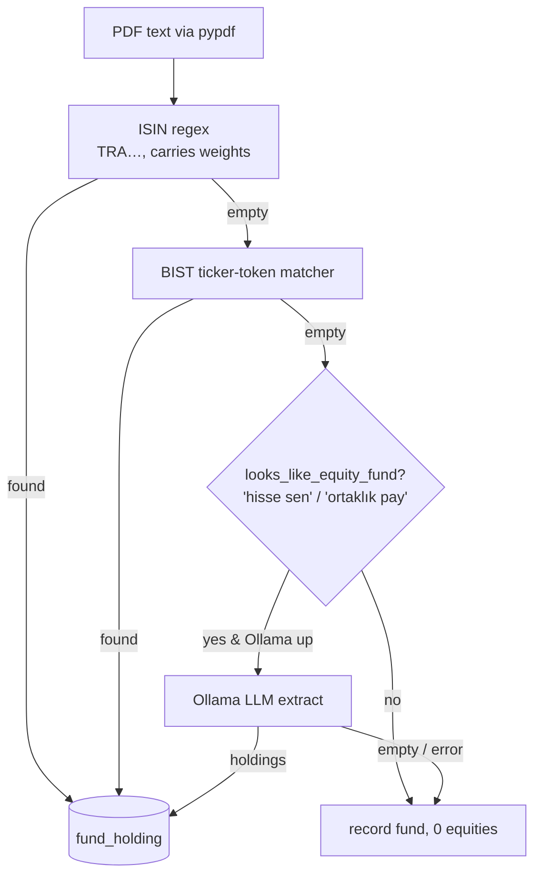

# 🤖 How the Ollama AI parser works

- **Date**: 2026-06-26
- **Scope**: How the local Ollama LLM is used as a *fallback* parser for KAP
  fund-portfolio PDFs — when it fires, how it's prompted, how its output is kept
  honest, and how it's deployed.
- **Code**: [`services/fund-scraper/ai_pdf_parser.py`](../../services/fund-scraper/ai_pdf_parser.py)
  (the parser), [`services/fund-scraper/fund_scraper.py`](../../services/fund-scraper/fund_scraper.py)
  (the caller), [`docker-compose.yml`](../../docker-compose.yml) (the `ollama` service).
- **Companion**: [2026-06-26-data-sources-and-processing.md](2026-06-26-data-sources-and-processing.md)
  covers the deterministic regex pipeline this AI step backs up.

> One-line summary: the AI is a **last-resort, locally-run, grounded** reader for
> fund PDFs whose layout the regex parser can't follow. It can only ever *drop*
> data, never invent it — every ticker it returns is validated against the real
> BIST universe, and any failure degrades to "no holdings."

---

## 1. Why it exists

The primary parser in `fund_scraper.py` is **deterministic regex**: it anchors on
the Turkish equity-ISIN pattern `TRA[A-Z][A-Z0-9]{8}` and a BIST-ticker token
matcher. That covers most "Fon Portföy Dağılım Raporu" (FPD) templates. But fund
managers publish in many layouts — some list holdings by **company name with no
ISIN**, some split the holdings table across columns the regex cannot pair. When
the regex (and the ticker-token fallback) come back **empty** on a document that
clearly *is* an equity fund, a local LLM reads the unfamiliar layout instead.

---

## 2. Where it sits in the pipeline — last resort only

For each fund PDF, `fund_scraper.py` tries parsers cheapest-first and stops at the
first that yields holdings:

Two gates keep the model off the hot path:
- **Anchored activation** — the AI runs only when `looks_like_equity_fund()` finds
  a stable Turkish equity-section anchor (`hisse sen` → *Hisse Senedi/Senetleri*,
  `ortaklık pay` → *Ortaklık Payları*). Pure bond / money-market funds never reach
  the model.
- **Self-disabling** — `is_available()` pings `GET /api/tags`; if no local Ollama
  answers `200`, the AI is switched off for the whole run and the scraper works
  regex-only. It is safe to leave enabled out of the box.

A holding parsed this way is tagged `parser_used = "ai"` in the run log.

---

## 3. How it's prompted — deterministic & bounded

`call_ollama()` POSTs to `…/api/generate` with settings chosen for **repeatable**
output (see the `ai-output-stability` skill):

| Setting | Value | Why |
|---|---|---|
| `model` | `llama3.1` (default) | local, no external API |
| `format` | `json` | force machine-readable output |
| `temperature` | `0` | deterministic decoding |
| `seed` | `42` | same doc → same extraction |
| `stream` | `false` | one complete reply |
| document cap | `MAX_TEXT_CHARS = 12000` | holdings sit near the top of the FPD; keeps the prompt bounded regardless of PDF size |

- **System prompt** pins the role: extract *only* individual BIST equity holdings
  (ticker + percentage weight), explicitly ignore government bonds, T-bills,
  reverse repo, deposits, participation accounts, other funds, derivatives, and
  total/subtotal rows, and **never invent a ticker** — JSON only, no prose.
- **User prompt** specifies the exact JSON shape
  (`{"holdings":[{"ticker":"AKBNK","weight":8.09},…]}`), allows `null` weights,
  and wraps the document text between `<<<DOC … DOC>>>` markers.

---

## 4. How its output is kept honest

Three layers turn a probabilistic model into a source the project can trust:

1. **Shape-tolerant parsing.** `parse_ai_response()` accepts either
   `{"holdings":[…]}` or a bare list; any JSON error or unexpected shape yields an
   empty list (degrade).
2. **Weight sanitisation.** `_coerce_weight()` accepts `8.09`, `"8,09"`, `"8.09"`
   and rejects anything outside `(0, 100]` (totals / garbage → `null`).
3. **Grounding against the real universe.** In `extract_holdings()`, every ticker
   must match `^[A-Z][A-Z0-9]{1,9}$` **and** be present in the known BIST universe
   loaded from `entity_ref`. A hallucinated or foreign code is dropped, never
   stored. Duplicates are de-duped (a stated weight upgrades a prior `null`).

**Degrade, never fabricate (ADR-0004).** If Ollama is unreachable, the model
errors, or the reply is unparseable, `extract_holdings()` returns `{}` and the
caller keeps the (empty) regex result. The scraper records the fund with zero
equities rather than guessing — consistent with the `approx`/gap philosophy in
[ADR-0003](../design/ADR-0003-staleness-confidence-flags.md).

The module is **import-side-effect-free** (no network or DB at import) and takes
an injected `requests`-style session, so every Ollama interaction is unit-tested
offline in [`services/fund-scraper/test_ai_pdf_parser.py`](../../services/fund-scraper/test_ai_pdf_parser.py).

---

## 5. How it's deployed

The `ollama` service in [`docker-compose.yml`](../../docker-compose.yml):

- **Image** `ollama/ollama`, CPU-only by default, under the `fund-scraper`
  compose profile (it only runs when you scrape).
- **Models persist** in the `ollama-models` named volume (`/root/.ollama`), so the
  model is pulled once and survives restarts.
- **Localhost-only** port `127.0.0.1:11434` — never exposed on the LAN. It joins
  `backend` (so the scraper reaches it at `ollama:11434`) and `edge` (so it can
  pull models from the internet; `backend` is internal-only).
- **One-time model pull**: `docker exec ollama ollama pull llama3.1` (~4.7 GB).

Configuration (env, with defaults) read by `config_from_env()`:

| Variable | Default | Meaning |
|---|---|---|
| `AI_PARSER_ENABLED` | `1` | master switch (still self-disables if Ollama is down) |
| `OLLAMA_HOST` | `http://ollama:11434` | local daemon URL |
| `OLLAMA_MODEL` | `llama3.1` | model name |
| `OLLAMA_TIMEOUT` | `120` | per-request seconds |

See [`deploy/env/fund-scraper.env.example`](../../deploy/env/fund-scraper.env.example)
for the documented template.

---

## 6. What it is *not*

- **Not** a primary data source — regex handles the common case; the AI only fills
  layout gaps it can't.
- **Not** a cloud service — there is no OpenAI/Anthropic/etc. call; inference is
  entirely local, so no fund document ever leaves the host.
- **Not** trusted blindly — its output is filtered through the same BIST-universe
  grounding every other parser uses, and it can only reduce, never fabricate.

---

## 7. References

- [ADR-0004](../design/ADR-0004-scraping-within-tos.md) — scraping within ToS (local-only, no evasion).
- [ADR-0003](../design/ADR-0003-staleness-confidence-flags.md) — confidence / degrade philosophy.
- [ADR-0005](../design/ADR-0005-pdf-library-selection.md) — PDF library selection.
- Code: [`ai_pdf_parser.py`](../../services/fund-scraper/ai_pdf_parser.py),
  [`fund_scraper.py`](../../services/fund-scraper/fund_scraper.py),
  [`test_ai_pdf_parser.py`](../../services/fund-scraper/test_ai_pdf_parser.py).
